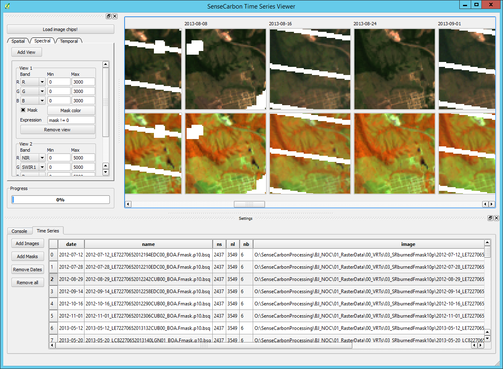

# README #

The SenseCarbon Time Series Viewer can be used to visualize time series of remote sensing data.
Its major aims are: 

(i) to support a [Quantum GIS (QGIS)](www.qgis.org) based labeling of time series data, 

(ii) to use the remote sensing imagery "as is" 

(iii) to avoid a complicated installation process

The viewer works with the python packages that are part of the most recent [Quantum GIS (QGIS)](www.qgis.org) 
installation. 

## Features ##
+ Uses the [Geospatial Data Abstraction Library (GDAL)](www.gdal.org), which supports up to 142 raster image [formats](http://www.gdal.org/formats_list.html)
+ Recognizes the temporal order of input images implicitly. Date-time information is extracted automatically: 
by evaluating each images meta data, the image filename or the entire file path to find a date-time stamp. 
+ Supports different spatial projections: There is no need to warp the image data into one projection.  
+ Supports different sensors: images similar in its spectral and spatial configuration are assumed to be taken by the same "sensor". 
+ Visualizes multiple band combinations, separated by sensor
+ Spatial extends of image chips can be specified in QGIS by selection of single coodinate or rectangle
+ Color scaling is applied to the entire time series, e.g. to visualize and compare surface reflectance data
  
 

## Missing Features / ToDo's ##

Several. It try to keep an updates list in the [issue section](https://bitbucket.org/jakimowb/sensecarbontsviewer/issues).
Some of them:

+ on-the-fly calculation of (simple) spectral indices
+ colorbar/gradient visualization of single bands 
+ support of mask information
+ temporal & spectral profiles
+ drag 'n drop interactivity
+ python2 and python 3 interoperability

Your feedback (wishes, comments, bugs, ...) is always welcome: [benjamin.jakimow@geo.hu-berlin.de](benjamin.jakimow@geo.hu-berlin.de).

## Installation ##
You really want to use [git](https://en.wikipedia.org/wiki/Git_%28software%29) to install and update the viewer. 

If git is not available in your shell, you can download it from [https://git-scm.com/downloads](https://git-scm.com/downloads). You can install git without admin rights.

### Windows ###

1. Open your command line and clone this repository to your local QGIS Python Plugin Folder

        cd %USERPROFILE%\.qgis2\python\plugins 
        git clone https://jakimowb@bitbucket.org/jakimowb/sensecarbontsviewer.git

2. Start QGIS, go to Plugins -> Manage and Install and enable the "SenseCarbon TSV" Plugin
3. Download updates if available

        cd %USERPROFILE%\.qgis2\python\plugins\sensecarbontsviewer
        git pull

## Licence and Use ##

This program is free software; you can redistribute it and/or modify it under the terms of the GNU General Public License as published by the Free Software Foundation; either version 2 of the License, or (at your option) any later version.