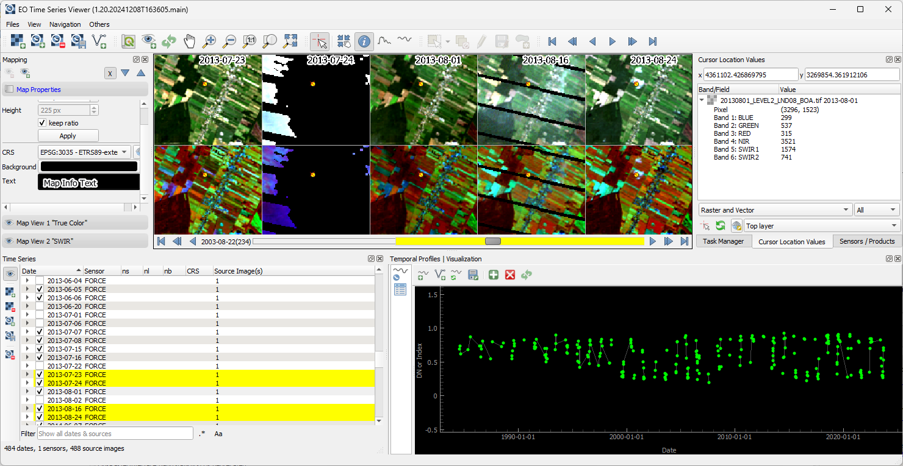

# README #

The EO Time Series Viewer is a [http://www.qgis.org](QGIS) plugin to visualize time series of remote sensing images.
Its major purpose is to ease the visualization and labeling of images from multiple sensors.

Visit http://eo-time-series-viewer.readthedocs.io/en/latest/ for more information.



# Installation

## Standard

1. Install QGIS 3.40 or newer from https://qgis.org/
2. Start QGIS
3. Use the QGIS qgisPlugin Manager to install the Earth Observation Time Series Viewer plugin

## Conda

1. Install QGIS environment
    ````bash
    conda install -n eotsv -f=https://raw.githubusercontent.com/jakimowb/eo-time-series-viewer/refs/heads/main/.conda/eotsv.yml
    ````

2. Start QGIS
3. Use the QGIS qgisPlugin Manager to install the Earth Observation Time Series Viewer plugin

## License and Use ##

The EO Time Series Viewer is licenced under the [GNU GPL-3 Licence](https://www.gnu.org/licenses/gpl-3.0.de.html).

## How to clone this repo

````bash
git clone --recurse-submodules git@github.com:jakimowb/eo-time-series-viewer.git
cd eo-time-series-viewer
git submodule update --init --recursive
````

## Run the unit tests

The scripts/runtests.sh helps to run the unittest with pytest.

```bash
./scripts/runtests.sh
```

Use ``QGIS_VERSION=<version tag>`` and docker compose to run the tests with a specific QGIS version
a [QGIS docker image](https://hub.docker.com/r/qgis/qgis)

```bash
QGIS_VERSION=3.44 docker compose -f .docker/docker-compose.gh.yml run --pull always --rm qgis /usr/src/.docker/run_docker_tests.sh -n auto
```
