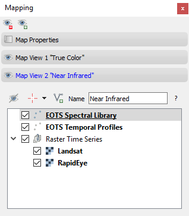

==========
User Guide
==========

Version 1.0
-----------

Toolbar
.......

.. image:: img/changelog.1.0/toolbar.old.png

Old toolbar

.. image:: img/changelog.1.0/toolbar.new.png

New toolbar

The toolbar was enhanced with an button to import vector sources, to select, add and save vector features, and to synchronize
the map canvas center with that of the QGIS main map canvas.

.. image:: img/changelog.1.0/select_features.png

Map Views
.........

The panel to control maps and map view properties has been reorganized and now uses a [QToolBox](https://doc.qt.io/qt-5/qtoolbox.html#details).

Each Map View now specifies it's own map layer tree, consisting of the raster layers related to the Raster Time Series and vector layers shown on-top.
The map layer visibility and vertical order is organized as known from the QGIS layer tree.

Map Canvas Context Menu
.......................

The map canvas context menu eases to control the appeared of each map layer.

Labeling Dock and Quick Labeling
................................

Time Series Model
.................

.. image:: img/changelog.1.0/timeseriessources.new.png

The multi-sensor time series allows to add multiple images with same sensor properties and observation date.
