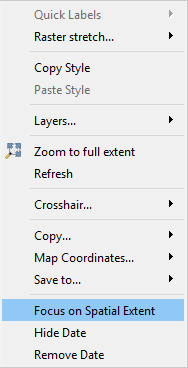
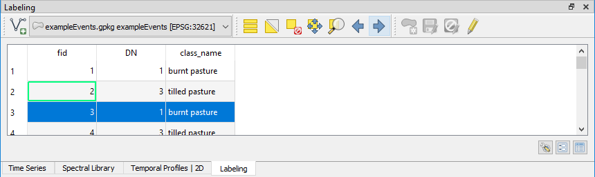
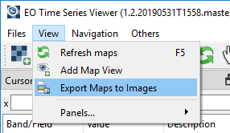
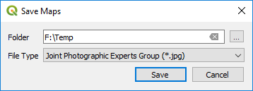
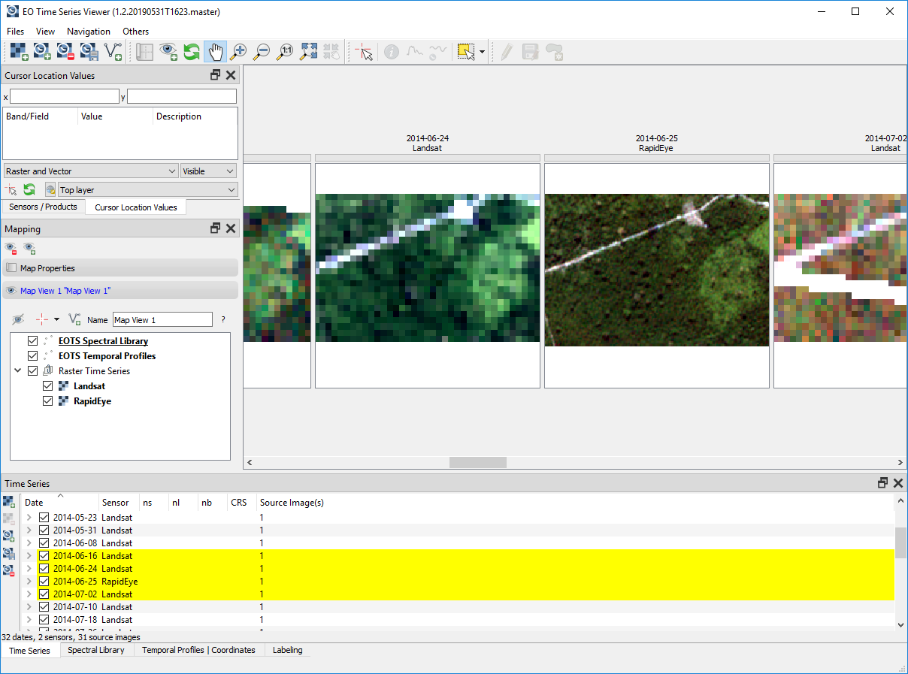
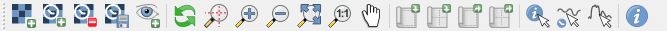
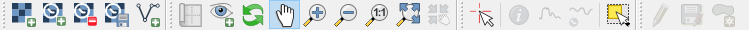
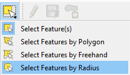
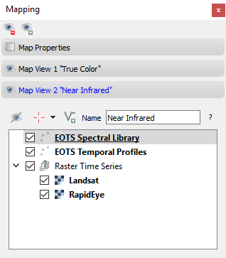
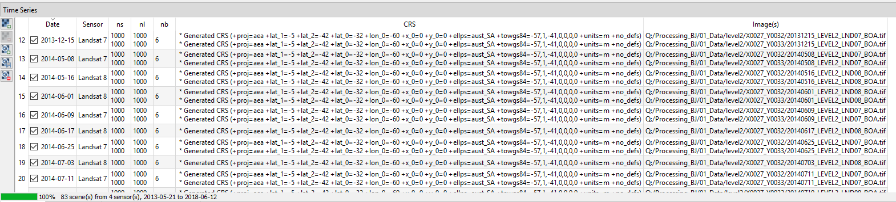

================
Visual Changelog
================

Version 1.10
------------

* improved matching of source images to sensors: matching can be specified in the settings dialog. Sensor matching
  based on ground sampling distance + number of bands + data type and optionally wavelength and/or sensor name

  .. figure:: img/settings_sensor_matching.png

* settings dialog allows to change the names of known sensors / image product specifications

* fixed copying of layer styles to maps of same sensor and map view type
* improved speed of mapping and layer buffering
* failed image sources are logged in teh EO Time Series Viewer log panel

  .. figure:: img/changelog.1.10/logpanel_failed_datasource_message.png

Version 1.9
-----------
* includes several smaller updates
* fixed error 'shortcutVisibleInContextMenu' error that occurred with Qt < 5.10
* enhanced wavelength extraction from GDAL metadata: wavelength can be specified per band

Version 1.8
-----------

* updated spectral library module
* fixed `#104 <https://bitbucket.org/jakimowb/eo-time-series-viewer/issues/104>`_: error in case of wrong spatial extent
* default CRS properly shown in map view settings
* user-defined CRS visible

Version 1.7
-----------

* increased contrast for default map view text
* improved reading of wavelength information, e.g. from Pleiades, Sentinel-2 and RapidEye data
* temporal profile plot: data gaps can be shown by breaks in the profile line, data source information is correctly shown for selected points only
* current extent can be copied via MapCanvas context menu
* fixed `#102 <https://bitbucket.org/jakimowb/eo-time-series-viewer/issues/102>`_: move maps to date of interest selected in a temporal profile plot

Version 1.6
-----------

* re-design of map visualization: faster and more compact, the number of maps is fixed to n dates x m map views
* date, sensor or map view information can be plotted within each map and become available in screenshots
* releases map layers that are not required any more
* slider + buttons to navigate over time series
* fixed preview in crosshair dialog

Version 1.5
-----------

* closing the EO Time Series Viewer instance will release all of its resources
* added "Lock Map Panel" to avoid unwanted resizing of central widget
* fixed missing updates of time series tree view when adding / removing source images
* map canvas context menu lists layers with spatial extent intersecting the cursor position only
* fixes feature selection error
* added quick label source image to label the path of raster layer

Version 1.4
-----------

* adding vector layers with sublayers will add all sublayers
* map canvas context menu "Focus on Spatial Extent" will hide maps without time series data for the current spatial extent

* labeling dock allows to iterate over vector features. the spatial map extent will be centered to each feature (`#26 <https://bitbucket.org/jakimowb/eo-time-series-viewer/issues/26>`_)

* added several convenience function to TimeSeriesViewer object
* fixed a bug that did not allow to create new polygon features
* temporal profile visualization: fixed icons to preview selected plot style, coordinate described by "<fid> <name>", e.g. "42 Deforested", fixed plot style preview
* updated SpectralLibraryViewer
* fixed spelling error in stacked band input dialog
* MapViews can add raster layers that have been opened in QGIS, e.g. XYZ Tile with OpenStreetMap data

Version 1.3
-----------

Bugfixes only

Version 1.2
-----------

Added menu option to export all maps as image files.

Fixes:

* select Temporal Profile / Spectral Profile button activates the required map tools (#91).
* map canvas context menu "copy to clipboard" options (#92).

Version 1.1
-----------

Time Series data sources are shown in a tree view, which improves the overview in case multiple source images exists per observation date.

Observation dates of visible Map Canvases are highlighted in the time series tree view.

Fixes:

* Sensor raster layer properties can be opened from MapView layer tree (#87). Stats will be related to center mapcanvas.
* StackedInputDialog, MapCanvas context menu, "Save Changes?" labeling dialog (#85),
* remove temporal profile (#86), draw new feature error (#84), Crosshair button status (#90), and some more

Version 1.0
-----------

Map Canvas Context Menu
.......................

The map canvas context menu has been re-organized and enhanced by:

    * zooming to single map layers
    * open the properties of single map layers
    * the "Set Quick Labels" button (see next feature)

Quick Labeling
..............

The map canvas menu entry "Set Quick Labels" can be used to write sensor/product, file and observations-date specific information
into attribute fields of linked vector layers.

1. open the layer properties of the vector layer you like to label
2. edit the form attributes and use the EOTS Quick Label form to each layer fields, that you like to
   label automatically.
3. Each map canvas relates to a raster timeseries sensor/product and observation date. From that we can derive the following label information:

    ============ ========= ==============
    Information  Data Type Example
    ============ ========= ==============
    Date         String    2014-04-01
    DOY          Integer
    Decimal Year Double    2014.234
    Sensor Name  String    Landsat
    File Path    String    image/....
    ============ ========= ==============

Labeling Dock
.............

The Labeling panel can be used to modify vector layers. The editing process is similar to that known from the QGIS
attribute tables.

1. Use the labeling panels combobox to select the vector layer you like to modify

2. Press the "Start Editing" button

3. Make your changes

4. Save your edits or reject them

Toolbar
.......

Old toolbar

New toolbar

The toolbar was enhanced with an button to import vector sources, to select, add and save vector features, and to synchronize
the map canvas center with that of the QGIS main map canvas.

Map Views
.........

The map view control panel has been reorganized based on the [QToolBox](https://doc.qt.io/qt-5/qtoolbox.html#details) widget.
This way fix a couple of layout issues, where map view settings looked squeezed. Each
Map View has now its own map layer tree to specify map layer visibility.

Time Series Model
.................

The multi-sensor time series allows to add multiple images with same sensor properties and observation date.

Version 0.8
-----------

- increased version to 0.8
- added labeling panel
- scheduled map canvas refreshes
- multiple images per observationdata & sensor
- fixed several bugs
- uses QgsTaskManager for background loading
- own QgsMapLayerStore to not mix-up with (main) QGIS layers

Version 0.7
-----------

- Visualization of images with stacked temporal information (each band = one observation date)
- Speclib I/O as CSV or ENVI-Spectral Library + CSV table for attributes
- temporary VRTs now created in-memory (gdal VSI mechanism) instead in a disk temp path

fixed bugs:
        - Spectral Library: profile coordinate now in center of map pixel (issue #66)
        - Save map canvas to clipboard
        - Width of plot lines now scale-independent (issue #64, QPen.setCosmetic(True))
        - adding fields to spectral library (issue #61)

Version 0.6
-----------

SpectralLibrary Module
......................

- now based on in-memory QgsVectorLayer
- Locations and values of spectral profile can be exported as vector data set
- Locations of spectral profiles can be rendered on MapCanvases

Temporal Profile Module
.......................

- now based on in-memory QgsVectorLayer
- Locations of temporal profiles can be exported as vector data set
- Band values of temporal profiles can be exported as CSV file
- Locations of temporal profiles can be rendered on MapCanvases
- several bug fixes

Version 0.5 and before
----------------------

- increased version to 0.5
- ported to QGIS 3, Qt5 and Python 3.6
- improvements in temporal profile visualization
- removed several bug
- visibility of vector and raster layers can be toggled per map view
- improved interaction between QGIS and EOTSV (Buttons to import/export spatial extent of map canvas or center)

2018-03-29
- improved definition of individual 2D / 3D charts per sensor & pixel-location
- added based OpenGL based 3D plot features (axis, grids, labels)
- changed name to "EO Time Series Viewer" (EOTSV)

2018-02-11
    - merged updates to temporal profile visualization, e.g.
      save temporal profiles, compare 2D profiles between different location, experimental 3D visualization

2018-01-31
    - added file filters for OpenFileDialog

2018-01-19
    - initialized Sphinx-based documentation
    - improved map visualization + map settings

2017-05-21:
    - many changes, done in development branch "develop",
    - e.g: QGIS MapCanvases for interactive maps, temporal profiles, ...

2017-02-14:
    - first setup for test users in the recent development branch

