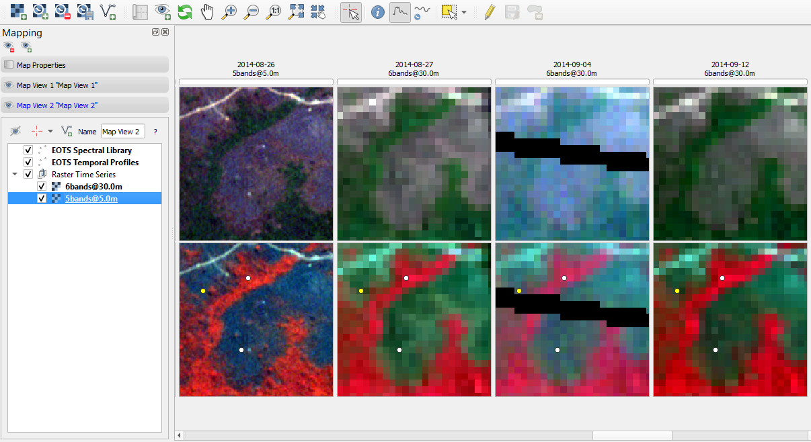
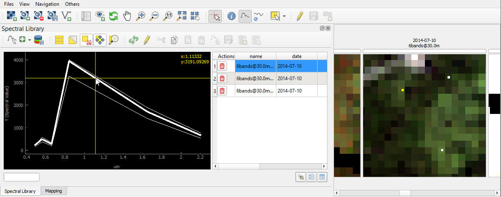
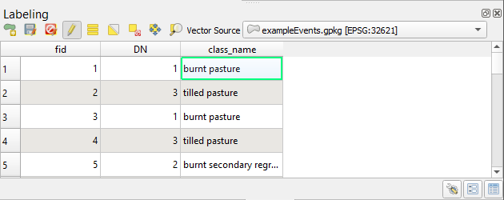
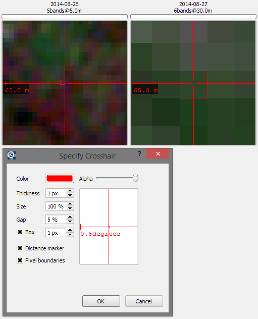

=======
Gallery
=======

This section gives you a visual glimpse at the functionalities of the Time Series Viewer plugin

Multiple Map Views
------------------

   Visualize a time series in several map views, for example to show a different band combination or highlight additional layers

Temporal plots
--------------

.. figure:: img/example_2dprofile.png
   :width: 100%

   Visualize temporal profiles at selected (in the map canvas) or imported (from a shapefile) locations and transform
   the values on-the-fly for plotting

Spectral plots
--------------

   Visualize and manage spectral profiles in a comprehensive spectral library tool

.. label time series

Labeling
--------

   Label your time series using a vector dataset and interactively zoom/pan to selected features in the map canvas

Image crosshair
---------------

   Detailed and fully customizable crosshair with pixel highlighting and scale bar

