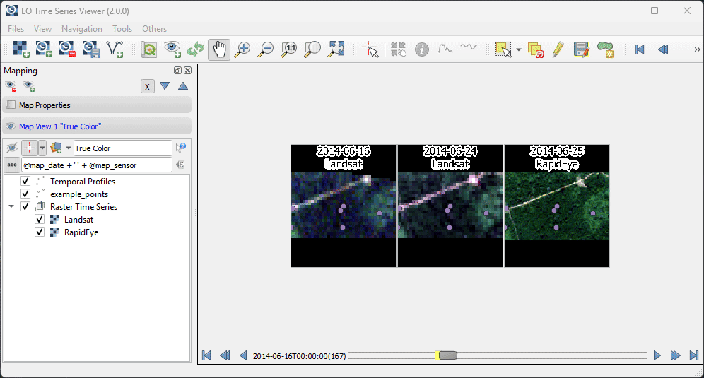
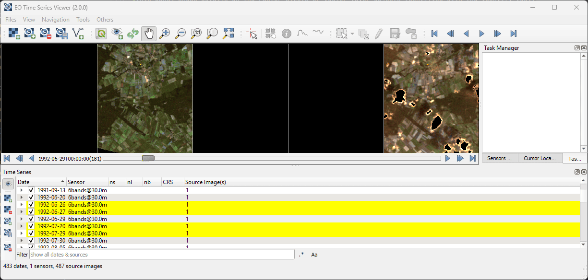
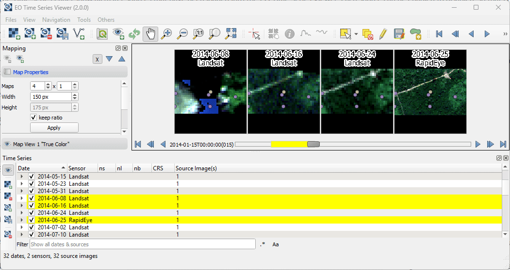

.. _gui:

========================
Graphical User Interface
========================

Overview
--------

This is how the EO Time Series Viewer's interface looks after opening the
example data (*Files > Add Example*).

You can use the mouse cursor to highlight different GUI parts and jump
to its linked descriptions.

.. raw:: html

    <svg width="1200" height="800" style="display: block; position: relative;">
      <defs>
        <filter x="0" y="0" width="1" height="1" id="text_bg">
          <feFlood flood-color="white" result="bg" />
          <feMerge>
            <feMergeNode in="bg"/>
            <feMergeNode in="SourceGraphic"/>
          </feMerge>
        </filter>
      </defs>

        <image href="_static/img/gui_overview.png" x="0" y="0"
            width="1085" height="682" />

          <g class="svg-hover-group">
            <a href="gui.html#menu-bar">
                <title>Menu Bar</title>
                <rect x="1" y="32" width="1084" height="20" />
                <text "url(#text_bg)" x="275" y="47">Menu Bar</text>
            </a>

            </g>

          <g class="svg-hover-group">
            <a href="gui.html#tool-bar">
                <title>Tool Bar</title>
                <rect x="1" y="50" width="1084" height="37" />
                <text filter="url(#text_bg)"
                      x="300" y="75">Tool Bar</text>
            </a></g>

          <g class="svg-hover-group">
            <a href="gui.html#map-visualization">
                <title>Mapping Panel</title>
                <text filter="url(#text_bg)"
                x="25" y="370">Mapping Panel</text>
                <rect x="2" y="90" width="225" height="331" />
            </a></g>

          <g class="svg-hover-group">
            <a href="gui.html#map-visualization">
                <title>Map Views</title>
                <text filter="url(#text_bg)"
                    x="456" y="200">Map Views</text>
                <rect x="230" y="90" width="614" height="331" />
            </a></g>

          <g class="svg-hover-group">
            <a href="gui.html#sensors-products-panel">
                <title>Sensor/Product Panel</title>
                <text filter="url(#text_bg)" x="875" y="245">Sensor/Products</text>
                <rect x="848" y="90" width="237" height="307" />
            </a></g>

          <g class="svg-hover-group">
            <a href="gui.html#time-series-panel">
                <title>Time Series Panel</title>
                <text filter="url(#text_bg)"
                    x="25" y="550">Time Series Panel</text>
                <rect x="2" y="424" width="223" height="256" />
            </a></g>

            <g class="svg-hover-group">
            <a href="gui.html#temporal-profile-view">
                <title>Temporal Profile Viewer</title>
                <text filter="url(#text_bg)"
                    x="450" y="550">Temporal Profile Viewer</text>
                <rect x="228" y="424" width="549"   height="256" />
            </a></g>

          <g class="svg-hover-group">
            <a href="gui.html#attribute-table">
                <title>Attribute Table</title>
                <text filter="url(#text_bg)"
                    x="837" y="550">Attribute Table</text>
                <rect x="780" y="424" width="305" height="256" />
            </a></g>

    </svg>

..
    .. figure:: img/interface.png
       :width: 100%

       This is what the EO Time Series Viewer's interface looks like when opening it.

    .. note:: Just like in QGIS, many parts of the GUI are adjustable panels. You can arrange them as tabbed, stacked or separate windows.
              Activate/Deactivate panels under :menuselection:`View --> Panels`

Menu Bar
--------

The menu bar give access to methods for handling data and visualization settings.

.. figure:: _static/img/gui_menubar.gif

    :width: 100%

The `Files` menu allows to add new raster sources to the time series, and other raster
and vector sources to overlay the time series data displayed in the map views.
You can also start specialized import dialogs, e.g. to load raster data
created with the FORCE processing framework.

The `View` menu can be used to show or hide the different panels and to add a new `map view` to the
map widget.

.. figure:: img/menu_view_panels.png

The `Navigation` menu allows to select map tools for navigation to different spatial extents.
It can also be used to copy the spatial extent from or to the map canvas of the main QGIS gui.

The `Tools` menu allows to start processing algorithms, e.g. to create a new temporal profile layer.

Tool Bar
--------

In the tool bar you find tools to add and modify data and to adjust the data visualization.

.. csv-table::
   :header: "Button", "Function"

   |mActionAddRasterLayer|, Add images to the time series
   |mActionAddTS|, Add Time Series from CSV
   |mActionRemoveTS|, Remove all images from Time Series
   |mActionSaveTS|, Save Time Series as CSV file
   |mActionAddOgrLayer|, Add vector data file
   |qgsMapCenter|, Synchronize with QGIS map canvas
   |mActionAddMapView|, Add maps that show a specified band selection
   |mActionRefresh|, Refresh maps
   |mActionPan|, Pan map
   |mActionZoomIn|, Zoom into map
   |mActionZoomOut|, Zoom out
   |mActionZoomActual|, Zoom to pixel scale
   |mActionZoomFullExtent|, Zoom to maximum extent of time series
   |pan_center|, Center map on clicked locations
   |select_location|, Identify Pixels and Features
   |mActionPropertiesWidget|, Identify cursor location values
   |profile|, Identify raster profiles to be shown in a Spectral Library
   |mIconTemporalProfile|, Identify pixel time series for specific coordinate
   |mActionSelectRectangle|, Select Features
   |mActionToggleEditing|, Start Editing Mode
   |mActionSaveEdits|, Save Edits
   |mActionCapturePolygon|, Draw a new Feature

.. note::

   Only after |select_location| :sup:`Identify Pixels and Features` is activated you can select the other identify tools
   (|mActionPropertiesWidget|, |profile|, |mIconTemporalProfile|). You can activate them all at once as well as  of them,
   in case of the latter variant clicking in the map has no direct effect (other than moving the crosshair, when activated)

Map Visualization
-----------------

The *Map Views* widget contains map canvases to visualize the observations of the raster time series.
The slider on the bottom allows to change the temporal window of observation dates that is shown.

Each canvas relates to a *Map View*, in which all raster images of the same sensor are
visualized with the same band combination and color stretch.
Using multiple map views allows to visualize different band combinations of the same raster
observation in parallel.

The *Mapping* panel allows to add or remove map views, change the canvas size and how canvases
are displayed within a map view.

A detailed overview on the map visualization options is described in :ref:`here <map_visualization>`

Sensors / Products Panel
------------------------

This panel show details on the *sensors* or *image product* types the time series
consists of, e.g. the number of bands and the spatial resolution.

For better handling, the *sensor names* can be changed.

Cursor Location Panel
---------------------

This panel shows details on the raster pixels or vector layer objects identified with the identify tool.

To load these layer details, activate the *identify cursor location value* tool
|select_location| with option |mActionPropertiesWidget| and use the mouse to click on the
location of interest.

.. figure:: img/cursor_location_panel.gif

Task Manager Panel
------------------

The *Task Manager* panel shows the progress of `QGIS tasks <https://docs.qgis.org/latest/en/docs/pyqgis_developer_cookbook/tasks.html>`_
which have been started from the EO Time Series Viewer.
For example, to set the visibility of the individual raster sources,
whether the source even contains valid raster pixels for the current displayed spatial map extent.

Time Series Panel
-----------------

The Time Series Panel show all raster sources that have been loaded into the time series.
Each source can be enabled to disabled, so that is will be not be shown in the map views.
The panel can be used to add additional sources, save the current sources into a
CSV file, or remove sources from the time series.

Temporal Profile View
---------------------

Here you can visualize temporal profiles that have been loaded for point coordinates.
The temporal profile view allows profiles from different vector layers to be shown together.
A detailed description can be found in the :ref:`Temporal Profiles section <temporal_profiles>`.

.. figure:: img/temporal_profile_panel.gif

Spectral Profile View
---------------------

This panel is used to visualize the spectral profiles.
To load a spectral profile from a raster image, activate the *identify cursor location value* tool
|select_location| with option *collect spectral profiles* |profile| and click with the mouse
on a location of interest.

The spectral profile view panel is the same as used in the :ref:`EnMAP-Box <EnMAP-Box>` .
For details, please visit the EnMAP-Box documentation for
`using spectral libraries <https://enmap-box.readthedocs.io/en/latest/usr_section/usr_manual/gui.html#spectral-library-view>`_.

Attribute Table
---------------

As known from QGIS, the attribute table allows to show and edit attributes of vector layer features.
The EO Time Series Viewer offers a similar attribute table with additional shortcuts for navigation and labeling.

For selected features, attribute values can be calculated based on short cuts accessible from
the map canvas and the temporal profile view context menus. These shortcuts are described in detail
in the :ref:`Quick Labeling <quick_labeling>` section.

.. AUTOGENERATED SUBSTITUTIONS - DO NOT EDIT PAST THIS LINE

.. |foobar| replace:: `EnMAP-Box <https://enmap-box.readthedocs.io>`_
.. |mActionAddMapView| image:: /icons/mActionAddMapView.png
   :width: 28px
.. |mActionAddOgrLayer| image:: /icons/mActionAddOgrLayer.png
   :width: 28px
.. |mActionAddRasterLayer| image:: /icons/mActionAddRasterLayer.png
   :width: 28px
.. |mActionAddTS| image:: /icons/mActionAddTS.png
   :width: 28px
.. |mActionCapturePolygon| image:: /icons/mActionCapturePolygon.png
   :width: 28px
.. |mActionPan| image:: /icons/mActionPan.png
   :width: 28px
.. |mActionPropertiesWidget| image:: /icons/mActionPropertiesWidget.png
   :width: 28px
.. |mActionRefresh| image:: /icons/mActionRefresh.png
   :width: 28px
.. |mActionRemoveTS| image:: /icons/mActionRemoveTS.png
   :width: 28px
.. |mActionSaveEdits| image:: /icons/mActionSaveEdits.png
   :width: 28px
.. |mActionSaveTS| image:: /icons/mActionSaveTS.png
   :width: 28px
.. |mActionSelectRectangle| image:: /icons/mActionSelectRectangle.png
   :width: 28px
.. |mActionToggleEditing| image:: /icons/mActionToggleEditing.png
   :width: 28px
.. |mActionZoomActual| image:: /icons/mActionZoomActual.png
   :width: 28px
.. |mActionZoomFullExtent| image:: /icons/mActionZoomFullExtent.png
   :width: 28px
.. |mActionZoomIn| image:: /icons/mActionZoomIn.png
   :width: 28px
.. |mActionZoomOut| image:: /icons/mActionZoomOut.png
   :width: 28px
.. |mIconTemporalProfile| image:: /icons/mIconTemporalProfile.png
   :width: 28px
.. |pan_center| image:: /icons/pan_center.png
   :width: 28px
.. |profile| image:: /icons/profile.png
   :width: 28px
.. |qgsMapCenter| image:: /icons/qgsMapCenter.png
   :width: 28px
.. |select_location| image:: /icons/select_location.png
   :width: 28px
