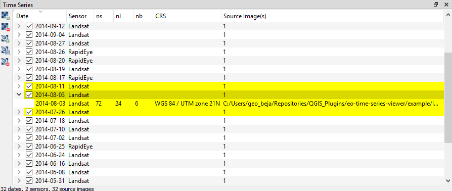

.. DEFINE ICONS AND IMAGE HERE

.. include:: /icon_links.rst

.. |cbc| image:: img/checkbox_checked.png

.. |mapviewbutton| image:: img/mapviewbutton.png
.. |questionmark| image:: img/questionmark.png

========================
Graphical User Interface
========================

Overview
--------

This is how the EO Time Series Viewer's interface looks after opening the
example data (*Files > Add Example*).

You can use the mouse cursor to highlight different GUI parts and jump
to its linked descriptions.

.. raw:: html

    <svg width="1200" height="800" style="display: block; position: relative;">
      <defs>
        <filter x="0" y="0" width="1" height="1" id="text_bg">
          <feFlood flood-color="white" result="bg" />
          <feMerge>
            <feMergeNode in="bg"/>
            <feMergeNode in="SourceGraphic"/>
          </feMerge>
        </filter>
      </defs>

        <image href="_static/img/gui_overview.png" x="0" y="0"
            width="1085" height="682" />

          <g class="svg-hover-group">
            <a href="gui.html#menubar">
                <title>Menu Bar</title>
                <rect x="1" y="32" width="1084" height="20" />
                <text "url(#text_bg)" x="275" y="47">Menu Bar</text>
            </a>

            </g>

          <g class="svg-hover-group">
            <a href="gui.html#toolbar">
                <title>Tool Bar</title>
                <rect x="1" y="50" width="1084" height="37" />
                <text filter="url(#text_bg)"
                      x="300" y="75">Tool Bar</text>
            </a></g>

          <g class="svg-hover-group">
            <a href="gui.html#map-view-settings">
                <title>Map View Settings</title>
                <text filter="url(#text_bg)"
                x="25" y="370">Map View Settings</text>
                <rect x="2" y="90" width="225" height="331" />
            </a></g>

          <g class="svg-hover-group">
            <a href="gui.html#map-views">
                <title>Map View</title>
                <text filter="url(#text_bg)"
                    x="456" y="200">Map Views</text>
                <rect x="230" y="90" width="614" height="331" />
            </a></g>

          <g class="svg-hover-group">
            <a href="gui.html#sensors-products">
                <title>Sensor/Product Panel</title>
                <text filter="url(#text_bg)" x="875" y="245">Sensor/Products</text>
                <rect x="848" y="90" width="237" height="307" />
            </a></g>

          <g class="svg-hover-group">
            <a href="gui.html#time-series">
                <title>Time Series Panel</title>
                <text filter="url(#text_bg)"
                    x="25" y="550">Time Series Panel</text>
                <rect x="2" y="424" width="223" height="256" />
            </a></g>

            <g class="svg-hover-group">
            <a href="gui.html#temporal-profiles">
                <title>Temporal Profile Viewer</title>
                <text filter="url(#text_bg)"
                    x="450" y="550">Temporal Profile Viewer</text>
                <rect x="228" y="424" width="549"   height="256" />
            </a></g>

          <g class="svg-hover-group">
            <a href="gui.html#attribute-table">
                <title>Attribute Table</title>
                <text filter="url(#text_bg)"
                    x="837" y="550">Attribute Table</text>
                <rect x="780" y="424" width="305" height="256" />
            </a></g>

    </svg>

..
    .. figure:: img/interface.png
       :width: 100%

       This is what the EO Time Series Viewer's interface looks like when opening it.

    .. note:: Just like in QGIS, many parts of the GUI are adjustable panels. You can arrange them as tabbed, stacked or separate windows.
              Activate/Deactivate panels under :menuselection:`View --> Panels`

Menu Bar
--------

    :width: 100%

The `Files` menu can be used to add different raster and vector sources. It also allows to
start import dialogs to load specialized data sources, e.g. raster data
created with the FORCE processing framework.

The `View` menu can be used to show or hide the different panels and to add a new `map view` to the
map widget.

The `Navigation` menu allows to select map tools for navigation to different spatial extents.
It can also be used to copy the spatial extent from or to the map canvas of the main QGIS gui.

The `Tools` menu allows to start processing algorithms, e.g. to create a new temporal profile layer.

Tool Bar
--------

In the tool bar you find tools to add and modify data and to adjust the data visualization.

.. csv-table::
   :header: "Button", "Function"

   |mActionAddRasterLayer|, Add images to the time series
   |mActionAddTS|, Add Time Series from CSV
   |mActionRemoveTS|, Remove all images from Time Series
   |mActionSaveTS|, Save Time Series as CSV file
   |mActionAddOgrLayer|, Add vector data file
   |qgsMapCenter|, Synchronize with QGIS map canvas
   |mActionAddMapView|, Add maps that show a specified band selection
   |mActionRefresh|, Refresh maps
   |mActionPan|, Pan map
   |mActionZoomIn|, Zoom into map
   |mActionZoomOut|, Zoom out
   |mActionZoomActual|, Zoom to pixel scale
   |mActionZoomFullExtent|, Zoom to maximum extent of time series
   |pan_center|, Center map on clicked locations
   |select_location|, Identify Pixels and Features
   |mActionPropertiesWidget|, Identify cursor location values
   |profile|, Identify raster profiles to be shown in a Spectral Library
   |mIconTemporalProfile|, Identify pixel time series for specific coordinate
   |mActionSelectRectangle|, Select Features
   |mActionToggleEditing|, Start Editing Mode
   |mActionSaveEdits|, Save Edits
   |mActionCapturePolygon|, Draw a new Feature

.. note::

   Only after |select_location| :sup:`Identify Pixels and Features` is activated you can select the other identify tools
   (|mActionPropertiesWidget|, |profile|, |mIconTemporalProfile|). You can activate them all at once as well as  of them,
   in case of the latter variant clicking in the map has no direct effect (other than moving the crosshair, when activated)

Map Visualization
-----------------

The map visualization allows to show the observations of a time series
side-by-side. Using multiple map-views, different band combinations can be shown in parallel,
by stacking them vertically.

The map settings panel controls the map visualization, e.g. the map canvas size.

The visualization of raster images is described in detail :ref:`here <map-visualization>`.

Sensors / Products Panel
------------------------

.. figure:: img/sensor_panel.gif

This panel list the different sensors/products the EO Time Series Viewer was able to
read from the time series sources.

For a better handling, the *sensor names* can be changed.

Cursor Location Panel
---------------------

.. figure:: img/cursor_location_panel.gif

The Identify tool extracts map information. Activate the *identify cursor location value*
option to show the related raster or vector layer values in the cursor location
info panel.

Task Manager Panel
------------------

The Task Manager Panel shows the progress of qgis tasks that run in a background thread.
It can be used to cancel long running tasks, like the extraction of temporal profiles.

Time Series Panel
-----------------

The Time Series Panel show all raster sources that have been loaded into the EO Time Series Viewer.
Each source can be enabled to disabled, so that is will be not show in the map views.
The panel can be used to add additional sources, save the current sources into a
CSV file, or remove sources from the time series.

Temporal Profile View
---------------------

Here you can visualize temporal profiles that have been loaded for point coordinates.
The temporal profile view allows profiles from different vector layers to be shown together.

A detailed description can be found :ref:` <here>`.

Spectral Profile View
---------------------

Here you can visualize and collect spectral profiles, i.e. the band value profiles related to
single pixel positions.

Spectral profiles are stored in vector layer fields.
The spectral profile view is the same as used in the EnMAP-Box.

For details, please visit https://enmap-box.readthedocs.io/en/latest/usr_section/usr_manual/gui.html#spectral-library-view

Attribute Table
---------------

As known from QGIS, the attribute table allows to show the attributes of a vector layer.
The EO Time Series Viewer enhances it by some functions for faster navigation

The EOTSV extends familiar functions, like the calcuation of vector attributes,
with additional tools to enable a faster
navigation to select vector features. Furthermore it adds shortcuts to
automatically fill vector attributes. These *Quick labeling* shortcuts are
described in more detail :ref:`<here>`.

