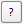

.. DEFINE ICONS AND IMAGE HERE

.. include:: /icon_links.rst

.. |cbu| image:: img/checkbox_unchecked.png

.. |timeseriesdock| image:: img/timeseriespanel.png
.. |mapviewbutton| image:: img/mapviewbutton.png

========================
Graphical User Interface
========================

Overview
--------

The following screenshot give an overview on the main EO Time Series Viewer components.
Use the mouse to highlight the different widgets explained below.

.. raw:: html

    

    <svg width="1200" height="800" style="display: block; position: relative;">
        

        <image href="_static/img/gui_overview.png" x="0" y="0"
            width="1085" height="682" />
        <text x="3" y="72">a)</text>
          <g class="hover-group">
            <a href="gui.html#toolbar">
            <rect x="1" y="50"
                width="1084"
                height="37"/>
                </a>
            </g>

         <text x="88" y="108">b)</text>
          <g class="hover-group">
            <a href="gui.html#map-view-settings">
            <rect x="2" y="90"
                width="225" height="331"/>
                </a>
            </g>

        <text x="250" y="108">c)</text>
          <g class="hover-group">
            <a href="gui.html#map-views">
            <rect x="230" y="90"
                width="614"
                height="331"/>
                </a>
            </g>

        <text x="989" y="108">d)</text>
          <g class="hover-group">
            <a href="gui.html#sensors-products">
            <rect x="848" y="90"
                width="237"
                height="307"/>
                </a>
            </g>

        <text x="88" y="440">e)</text>
          <g class="hover-group">
            <a href="gui.html#time-series">
            <rect x="2" y="424"
                width="223"
                height="256"/>
                </a>
            </g>

        <text x="520" y="440">f)</text>
          <g class="hover-group">
            <a href="gui.html#temporal-profiles">
            <rect x="228" y="424"
                width="549"
                height="256"/>
                </a>
            </g>

        <text x="920" y="495">g)</text>
          <g class="hover-group">
            <a href="gui.html#attribute-table">
            <rect x="780" y="424"
                width="305"
                height="256"/>
                </a>
            </g>

    </svg>

..
    .. figure:: img/interface.png
       :width: 100%

       This is what the EO Time Series Viewer's interface looks like when opening it.

    .. note:: Just like in QGIS, many parts of the GUI are adjustable panels. You can arrange them as tabbed, stacked or separate windows.
              Activate/Deactivate panels under :menuselection:`View --> Panels`

Toolbar
-------

The toolbar allows to start the following actions:

.. csv-table::
   :header: "Button", "Function"

   |mActionAddRasterLayer|, Add images to the time series
   |mActionAddTS|, Add Time Series from CSV
   |mActionRemoveTS|, Remove all images from Time Series
   |mActionSaveTS|, Save Time Series as CSV file
   |mActionAddOgrLayer|, Add vector data file
   |qgsMapCenter|, Synchronize with QGIS map canvas
   |mActionAddMapView|, Add maps that show a specified band selection
   |mActionRefresh|, Refresh maps
   |mActionPan|, Pan map
   |mActionZoomIn|, Zoom into map
   |mActionZoomOut|, Zoom out
   |mActionZoomActual|, Zoom to pixel scale
   |mActionZoomFullExtent|, Zoom to maximum extent of time series
   |pan_center|, Center map on clicked locations
   |select_location|, Identify Pixels and Features
   |mActionPropertiesWidget|, Identify cursor location values
   |profile|, Identify raster profiles to be shown in a Spectral Library
   |mIconTemporalProfile|, Identify pixel time series for specific coordinate
   |mActionSelectRectangle|, Select Features
   |mActionToggleEditing|, Start Editing Mode
   |mActionSaveEdits|, Save Edits
   |mActionCapturePolygon|, Draw a new Feature

.. note::

   Only after |select_location| :sup:`Identify Pixels and Features` is activated you can select the other identify tools
   (|mActionPropertiesWidget|, |profile|, |mIconTemporalProfile|). You can activate them all at once as well as  of them,
   in case of the latter variant clicking in the map has no direct effect (other than moving the crosshair, when activated)

Map View Settings
-----------------

The Map Settings Panel allows to configure how spatial maps are
visualized in the Map View Widget.

Map Views
---------

The Map View widget contains map canvases to visualize the time series data.
Canvases are ordered vertically by a) map views and horizontally b) by observation time.

Sensors / Products
------------------

This panel list the different sensors or sensor products the EO Time Series Viewer was able to
read from the time series sources.

Cursor Location
---------------

The cursor location panel visualized the vector or raster information,
that has been extracted for a map position of interest using the cursor location info tool.

Task Manager
------------

The Task Manager Panel shows the progress of running background tasks.
It can be used to cancel long running tasks, like the extraction of temporal profiles.

Time Series Panel
-----------------

The Time Series Panel show all raster sources that have been loaded into the EO Time Series Viewer.
Each source can be enabled to disabled, so that is will be not show in the map views.
The panel can be used to add additional sources, save the current sources into a
CSV file, or remove sources from the time series.

Temporal Profile View
---------------------

Spectral Profile View
---------------------

Attribute Table
---------------

