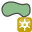

.. |add_class| image:: /../../eotimeseriesviewer/ui/icons/add_class.svg
   :width: 28px

.. |lockedGray| image:: img/qgis_icons/lockedGray.png 
   :width: 28px

.. |mActionAtlasLast| image:: ..\static\qgis_icons\mActionAtlasLast.png 
   :width: 28px
.. |mActionAtlasNext| image:: ..\static\qgis_icons\mActionAtlasNext.png 
   :width: 28px

.. |mActionCopySelected| image:: /../../eotimeseriesviewer/ui/icons/mActionCopySelected.png
   :width: 28px
.. |mActionEditCopy| image:: ..\static\qgis_icons\mActionEditCopy.png 
   :width: 28px
.. |mActionEditPaste| image:: ..\static\qgis_icons\mActionEditPaste.png 
   :width: 28px

.. |mActionFileSave| image:: ..\static\qgis_icons\mActionFileSave.png 
   :width: 28px
.. |mActionFileSaveAs| image:: ..\static\qgis_icons\mActionFileSaveAs.png 
   :width: 28px

.. |mActionOpenTable| image:: ..\static\qgis_icons\mActionOpenTable.png 
   :width: 28px

.. |mActionZoomActual| image:: ..\static\qgis_icons\mActionZoomActual.png 
   :width: 28px
.. |mActionZoomFullExtent| image:: ..\static\qgis_icons\mActionZoomFullExtent.png 
   :width: 28px
.. |mActionZoomIn| image:: ..\static\qgis_icons\mActionZoomIn.png 
   :width: 28px
.. |mActionZoomOut| image:: ..\static\qgis_icons\mActionZoomOut.png 
   :width: 28px

.. |mActionZoomToSelected| image:: ..\static\qgis_icons\mActionZoomToSelected.png 
   :width: 28px

.. |mapview2| image:: /../../eotimeseriesviewer/ui/icons/mapview2.svg
   :width: 28px

.. |mIconCollapse| image:: ..\static\qgis_icons\mIconCollapse.png 
   :width: 28px
.. |mIconExpand| image:: ..\static\qgis_icons\mIconExpand.png 
   :width: 28px

.. |mIconSelectTemporalProfile| image:: /../../eotimeseriesviewer/ui/icons/mIconSelectTemporalProfile.svg
   :width: 28px

.. |mIconTemporalProfileRefresh| image:: img/qgis_icons/mIconTemporalProfileRefresh.png 
   :width: 28px
.. |mIconVirtualRaster| image:: /../../eotimeseriesviewer/ui/icons/mIconVirtualRaster.svg
   :width: 28px
.. |mIconVirtualRaster2| image:: /../../eotimeseriesviewer/ui/icons/mIconVirtualRaster2.svg
   :width: 28px
.. |pickrasterspectrum| image:: img/qgis_icons/pickrasterspectrum.png 
   :width: 28px

.. |qgis_icon| image:: ..\static\qgis_icons\qgis_icon.png 
   :width: 28px

.. |remove_class| image:: /../../eotimeseriesviewer/ui/icons/remove_class.svg
   :width: 28px

.. |stylepreset| image:: img/qgis_icons/stylepreset.png 
   :width: 28px

.. |center_map| image:: img/qgis_icons/center_map.png 
   :width: 28px

.. |classinfo_add| image:: ..\static\qgis_icons\classinfo_add.png 
   :width: 28px

.. |cursor_zoom_pixelscale| image:: img/qgis_icons/cursor_zoom_pixelscale.png 
   :width: 28px

.. |poly2speclib| image:: ..\static\qgis_icons\poly2speclib.png 
   :width: 28px
.. |profile| image:: img/qgis_icons/profile.png 
   :width: 28px

.. |profile_dontreceive| image:: img/qgis_icons/profile_dontreceive.png 
   :width: 28px

.. |select_location| image:: ..\static\qgis_icons\select_location.png 
   :width: 28px

.. |mActionSaveEdits| image:: ..\static\qgis_icons\mActionSaveEdits.png 
   :width: 28px

.. |mActionToggleEditing| image:: ..\static\qgis_icons\mActionToggleEditing.png 
   :width: 28px
