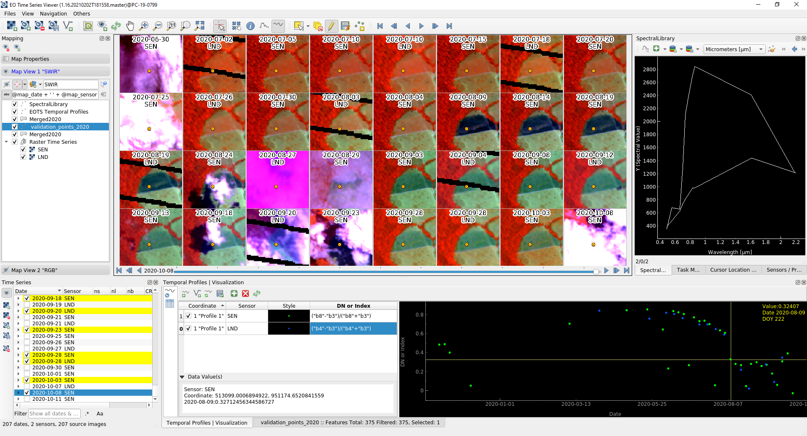

.. HUB TimeSeriesViewer documentation master file, created by
   sphinx-quickstart on Fri Jan 19 11:57:19 2018.
   You can adapt this file completely to your liking, but it should at least
   contain the root `toctree` directive.

======================
HUB Time Series Viewer
======================

**Welcome to the HUB Time Series Viewer Documentation!**

.. seealso:: `EnMAP Box 3 <https://bitbucket.org/hu-geomatics/enmap-box/wiki/Home>`_ - Another QGIS Plugin developed at HUB

About
-----

The Humboldt-Universität zu Berlin (HUB) Time Series Viewer (TSV) is a QGIS Plugin to visualize raster based earth observation time series data.

Its major aims are:

* an integrated visualization and labeling of multi-sensor remote-sensing time-series data, based on `QGIS <http://www.qgis.org>`_
* to minimize the user-interaction ("mouse-clicks") required to optimize different ways of data representation.
* an (almost) platform independent installation

Features
--------

* Raster images can be added to the time series without homogenisation of spatial extent or coordinate reference system. Time stamps are extracted automatically from (i) image meta data ("acquisition date"), (ii) the file name or (iii) the file directory path.
* Raster IO uses the `Geospatial Data Abstraction Library (GDAL) <http://www.gdal.org>`_, which supports up to 142 `different raster formats <http://www.gdal.org/formats_list.html>`_.
* Distinguished sensors by pixel size and number of bands and, if available, band wavelength information and sensor name.
* Spatial-temporal ("maps") visualisation allows to show multiples band combinations in parallel, e.g. True Color and coloured infrared.
* Color stretches are applied to all raster images of same sensor and band combination. This helps to optimise color stretches for multiple images in a minimum of time.
* Spectral-temporal ("time profile") visualisation shows raw or scaled, sensor specific band values.

Missing Features / Outlook
~~~~~~~~~~~~~~~~~~~~~~~~~~

* a lot of debugging, making the small errors gone.
* 3D plotting for spectral-temporal surfaces
* export temporal profiles
* export spectral libraries
* show location of selected spectra

Feedback
~~~~~~~~

Your feedback (wishes, comments, bugs, ...) is always welcome. Add it to the `issue section <https://bitbucket.org/jakimowb/hub-timeseriesviewer/issues?status=new&status=open>`_
or send me an email `benjamin.jakimow@geo.hu-berlin.de <benjamin.jakimow@geo.hu-berlin.de>`_.

License and Use
---------------

This program is free software; you can redistribute it and/or modify it under the terms of the `GNU General Public License Version 3 (GNU GPL-3) <https://www.gnu.org/licenses/gpl-3.0.en.html>`_ , as published by the Free Software Foundation. See also :ref:`License`.

..  toctree::
    :maxdepth: 3
    :caption: Contents:

    news.rst
    installation.rst
    User Guide <user_guide.rst>
    gallery.rst
    License <LICENSE.md>

Indices and tables
==================

* :ref:`genindex`
* :ref:`modindex`
* :ref:`search`
