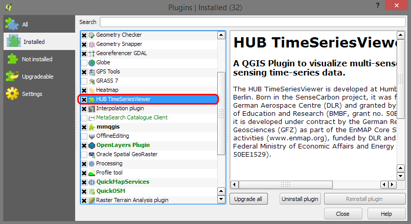

============
Installation
============

.. warning:: Time Series Viewer requires QGIS Version 2.18.xx

A. Standard QGIS Plugin Installation
------------------------------------

1. Download the most recent zip archive of the HUB TimeSeriesViewer QGIS Plugin from https://bitbucket.org/jakimowb/hub-timeseriesviewer/downloads
2. Extract the ``timeseriesviewerplugin`` folder and copy it to the user' QGIS python plugin directory
``~/.qgis2/python/plugins/timeseriesviewerplugin``

    Alternatively, you can choose any other folder ``my/qgis/plugins/timeseriesviewerplugin`` if your ensure that it is known to the QGIS_PLUGINPATH:

    * In QGIS, go to Settings >> Options >> System.
    * Enable the Environment group box.
    * Create a new entry that append ``my/qgis/plugins`` to the variable ``QGIS_PLUGINPATH``.

3. Finally restart QGIS, open the Plugin Manager and enable the HUB-TimeSeriesViewer.

B. Developers
-------------

You really want to use `git <https://en.wikipedia.org/wiki/Git_%28software%29>`_ to install and update the viewer.

If git is not available in your shell, you can download it from `<https://git-scm.com/downloads>`_. You can install git without admin rights.

Larger binary files, e.g. for exemplary data, will are distributed via the Git Large File Storage (lfs) extension `<https://git-lfs.github.com>`_.

1. Open your shell and clone the repository into a local QGIS Python Plugin Folder::

        cd %USERPROFILE%\.qgis2\python\plugins
        git clone https://bitbucket.org/jakimowb/hub-timeseriesviewer.git

2. Checkout the development branch (this might change with the fist stable master version)::

        git checkout development
        git lfs checkout

3. Start QGIS, go to Plugins -> Manage and Install and enable the "HUB TimeSeriesViewer" Plugin
4. Download updates if available::

        cd %USERPROFILE%\.qgis2\python\plugins\hub-timeseriesviewer
        git pull

