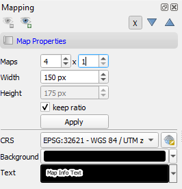

.. _map_visualization:

=================
Map Visualization
=================

Map Properties
..............

In the map properties box you can specify :guilabel:`Width` and :guilabel:`Height`, as well as background :guilabel:`Color` and the :guilabel:`CRS` of the single map canvases.
Click :guilabel:`Apply` to apply changes. By default the :guilabel:`keep ratio` option is |cbc| checked, i.e. height will be the same as width. In case
you want to have unequally sized views, deactivate this option.

.. * :guilabel:`Set Center` center the QGIS Map View to the same coordinate as the EO TSV Map View
.. * :guilabel:`Get Center` center the EO TSV Map View to the same coordinate as the QGIS Map View
.. * :guilabel:`Set Extent` zoom the QGIS Map View to the same extent as the EO TSV Map View
.. * :guilabel:`Get Extent` zoom the EO TSV Map View to the same extent as the QGIS Map View
.. * ``Load center profile``, when checked |cbc|, the temporal profile of the center pixel will automatically be displayed and updated in the :ref:`Profile View` tab.

Map Views
.........

A map view is a row of map canvases that show the time series images of different sensors/product in the same band combination, e.g. as "True Color bands".
The map view panel allows to add or remove map views and to specifiy how the images of each sensor are to be rendered.

* You can *add new Map Views* using the |mActionAddMapView| button. This will create a new row of map canvases. Remove a map view with the |mActionRemoveMapView| button.
* In case the Map View does not refresh correctly, you can 'force' the refresh using the |mActionRefresh| button (which will also apply all the render settings).
* Access the settings for individual Map Views by clicking in the mapview |mapviewbutton|
* You can use the |questionmark| button to highlight the current Map View selected in the dropdown menu (respective image chips will show red margin for a few seconds).

For every Map View you can alter the following settings:

* *Hide/Unhide* the Map View via the |mapviewHidden| :superscript:`Toggle visibility of this map view` button.

* *Activate/Deactivate Crosshair* via the |crosshair| :superscript:`Show/hide a crosshair` button. Press the arrow button next to it to enter
  the *Crosshair specifications* |symbology| , where you can customize e.g. color, opacity, thickness, size and further options.

* You may rename the Map View by altering the text in the :guilabel:`Name` field.

.. * **Vector Rendering** allows you to visualize vector data (e.g. a shapefile). In order to do so, open the file in QGIS. Once loaded in the QGIS Layers Panel, it will become selectable
..  in the dropdown menu. Vector styling will be same as in QGIS (i.e. if you want to adjust it, do it in QGIS). Check |cbc| or uncheck |cbu| in order to activate/deactivate Vector Rendering.
Furthermore, you can visualize the locations of :ref:`Temporal Profiles` or :ref:`Spectral Profiles <Spectral Library>` as points. Select the desired option
from the dropdown list.

**Layer representation:**

* Similar to QGIS you can change the visual representation of raster or vector layers in the layer properties. To open them,
  right-click on the layer you want to alter and select :menuselection:`Set Properties --> Style`

  .. image:: img/layerproperties.png

|

Cursor Location Values
-----------------------

This tools lets you inspect the values of a layer or multiple layers at the location where you click in the map view. To select a location (e.g. pixel or feature)
use the |select_location| :superscript:`Select Cursor Location` button and click somewhere in the map view.

* The Cursor Location Value panel should open automatically and list the information for a selected location. The layers will be listed in the order they appear in the Map View.
  In case you do not see the panel, you can open it via :menuselection:`View --> Panels --> Cursor Location Values`.

  .. figure:: img/cursorlocationvalues.png

* By default, raster layer information will only be shown for the bands which are mapped to RGB. If you want to view all bands, change the :guilabel:`Visible` setting
  to :guilabel:`All` (right dropdown menu). Also, the first information is always the pixel coordinate (column, row).
* You can select whether location information should be gathered for :guilabel:`All layers` or only the :guilabel:`Top layer`. You can further
  define whether you want to consider :guilabel:`Raster and Vector` layers, or :guilabel:`Vector only` and :guilabel:`Raster only`, respectively.
* Coordinates of the selected location are shown in the :guilabel:`x` and :guilabel:`y` fields. You may change the coordinate system of the displayed
  coordinates via the |mActionSetProjection| :superscript:`Select CRS` button (e.g. for switching to lat/long coordinates).

.. AUTOGENERATED SUBSTITUTIONS - DO NOT EDIT PAST THIS LINE

.. |cbc| image:: /img/checkbox_checked.png
.. |cbu| image:: /img/checkbox_unchecked.png
.. |crosshair| image:: /icons/crosshair.png
   :width: 28px
.. |mActionAddMapView| image:: /icons/mActionAddMapView.png
   :width: 28px
.. |mActionRefresh| image:: /icons/mActionRefresh.png
   :width: 28px
.. |mActionRemoveMapView| image:: /icons/mActionRemoveMapView.png
   :width: 28px
.. |mActionSetProjection| image:: /icons/mActionSetProjection.png
   :width: 28px
.. |mapviewHidden| image:: /icons/mapviewHidden.png
   :width: 28px
.. |mapviewbutton| image:: /img/mapviewbutton.png
.. |questionmark| image:: /img/questionmark.png
.. |select_location| image:: /icons/select_location.png
   :width: 28px
.. |symbology| image:: /icons/symbology.png
   :width: 28px
