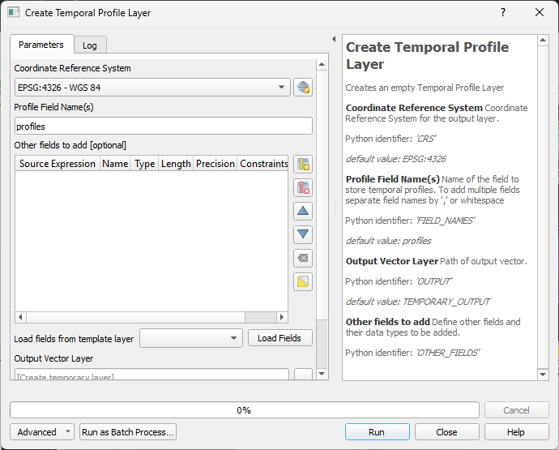
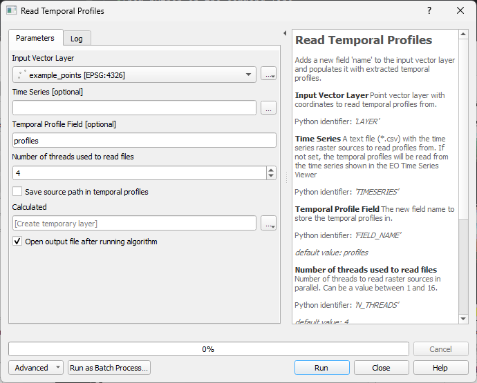

QGIS Processing Algorithms
==========================

The EO Time Series Viewer adds processing algorithms to the QGIS processing framework.
They can be started from the *Tools* menu in the menu bar, from the QGIS processing toolbox,
from python and the command line.

Create Temporal Profile Layer
-----------------------------

This processing algorithm (``eotsv:createemptytemporalprofilelayer``)
create an new point vector layer with a field to store temporal profiles.

The default name of the field to store temporal profiles in is *profiles*.
It can be changed, and adding multiple field names, separated by `,` or white spaces,
allows to create multiple profile fields.

Furthermore, the "Other Fields" widget allows to define the name and data types of
additional vector layer fields.

This is how the algorithm can be called from a shell:

.. code-block:: bash

    qgis_process run eotsv:createemptytemporalprofilelayer \
            --distance_units=meters \
            --area_units=m2 \
            --ellipsoid=NONE \
            --CRS='EPSG:4326' \
            --FIELD_NAMES=profiles \
            --OUTPUT=TEMPORARY_OUTPUT

Read Temporal Profiles
----------------------

The *Read Temporal Profiles* (``eotsv:readtemporalprofiles``) algorithm extracts temporal
profiles for each position of the input point vector layer.

The time series use for is either given by the sources in the EO Time Series Viewer (default),
but can be specified with an explicit CSV list of image sources too.

This is how the algorithm can be called from a shell:

.. code-block:: bash

    qgis_process run eotsv:readtemporalprofiles \
            --distance_units=meters \
            --area_units=m2 \
            --ellipsoid=NONE
            --LAYER='<path to input vector point layer' \
            --TIMESERIES='<path to *.csv file with raster sources>' \
            --FIELD_NAME=profiles \
            --N_THREADS=4 \
            --ADD_SOURCES=false \
            --OUTPUT=TEMPORARY_OUTPUT

Create Spectral Library
-----------------------

This algorithm creates a new vector layer to save spectral profiles.
A new spectral profile widgets will be opened automatically and show the new (and empty)
vector layer with a field for spectral profiles.

