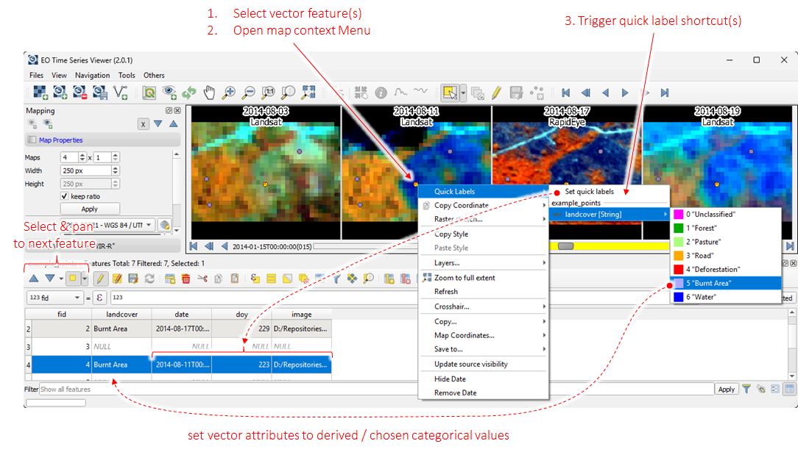
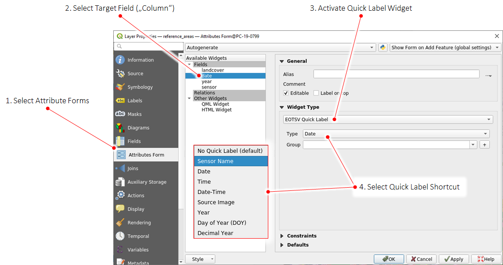

.. _quick_labeling:

==============
Quick Labeling
==============

The EO Time Series Viewer assists you in describing, i.e. *label* reference data, e.g. by describing vector geometries
with a related land cover type or observed events. Whether your
locations (point, lines or polygons) of interest already exist, or need to be digitized on the visualized maps,
in both cases you want to describe them in the attribute table of the vector layer.

The EO Time Series Viewer supports this with "Quick Label" short-cuts from the map context menu. If triggered, they send
temporal or categorical information direct to the attribute cells of selected geometries, e.g a polygon that has been
selected in a map.

Let's assume we have a map related to a Landsat (LND) observation taken at 2019-02-05T11:23:42.00.
The following table shows how this is translated into linked vector fields:

.. table:: Mapping of Quick Labels information into vector layer attributes

  +-------------------+---------------------+------+----------+---------------------+------------+----------+------+------+
  |                   |                 Type of linked vector layer field                                                 |
  +-------------------+---------------------+------+----------+---------------------+------------+----------+------+------+
  | LabelType         | varchar             | int  | double   | datetime            | date       | time     | bool | blob |
  +===================+=====================+======+==========+=====================+============+==========+======+======+
  | Date              | 2019-02-05          |      |          | 2019-02-05T00:00:00 | 2019-02-05 |          |      |      |
  +-------------------+---------------------+------+----------+---------------------+------------+----------+------+------+
  | Date-Time         | 2019-02-05T11:23:42 |      |          | 2019-02-05T11:23:42 | 2019-02-05 |          |      |      |
  +-------------------+---------------------+------+----------+---------------------+------------+----------+------+------+
  | Time              | 11:23:42            |      |          | 2019-02-05T11:23:42 |            | 11:23:42 |      |      |
  +-------------------+---------------------+------+----------+---------------------+------------+----------+------+------+
  | Day of Year (DOY) | 36                  | 36   | 36       |                     |            |          |      |      |
  +-------------------+---------------------+------+----------+---------------------+------------+----------+------+------+
  | Year              | 2019                | 2019 |          | 2019-02-05T11:23:42 | 2019-02-05 | 11:23:42 |      |      |
  +-------------------+---------------------+------+----------+---------------------+------------+----------+------+------+
  | Decimal Year      | 2019.0980926430518  | 2019 | 2019.098 |                     |            |          |      |      |
  +-------------------+---------------------+------+----------+---------------------+------------+----------+------+------+
  | Sensor Name       | LND                 |      |          |                     |            |          |      |      |
  +-------------------+---------------------+------+----------+---------------------+------------+----------+------+------+
  | Source Image      | /path/to/image      |      |          |                     |            |          |      |      |
  +-------------------+---------------------+------+----------+---------------------+------------+----------+------+------+

To use Quick Labels, open the vector layer properties and activate them in the Attribute Form widget:

Labeling categorical values
---------------------------

Customized quick label values
-----------------------------