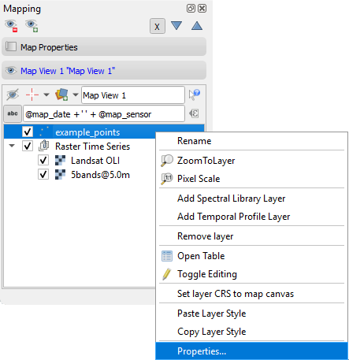
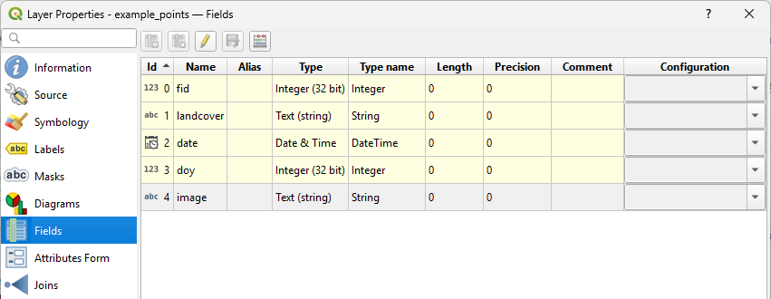
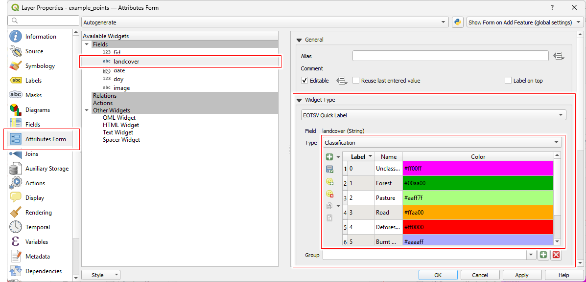
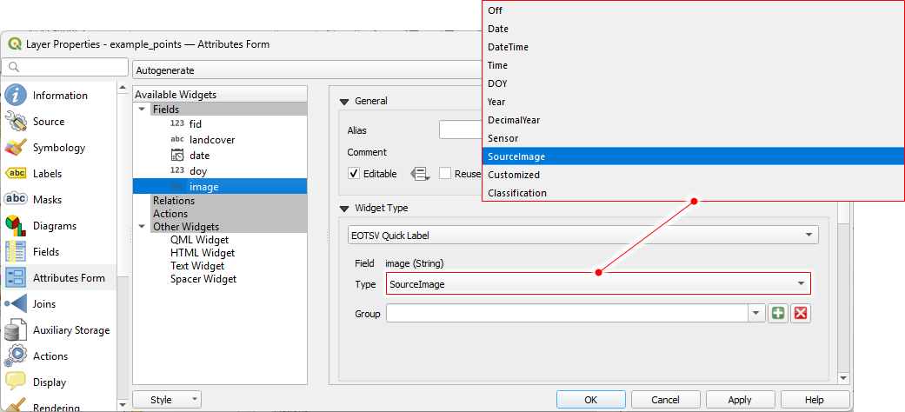
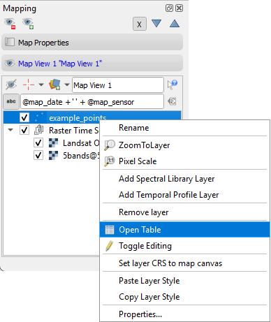
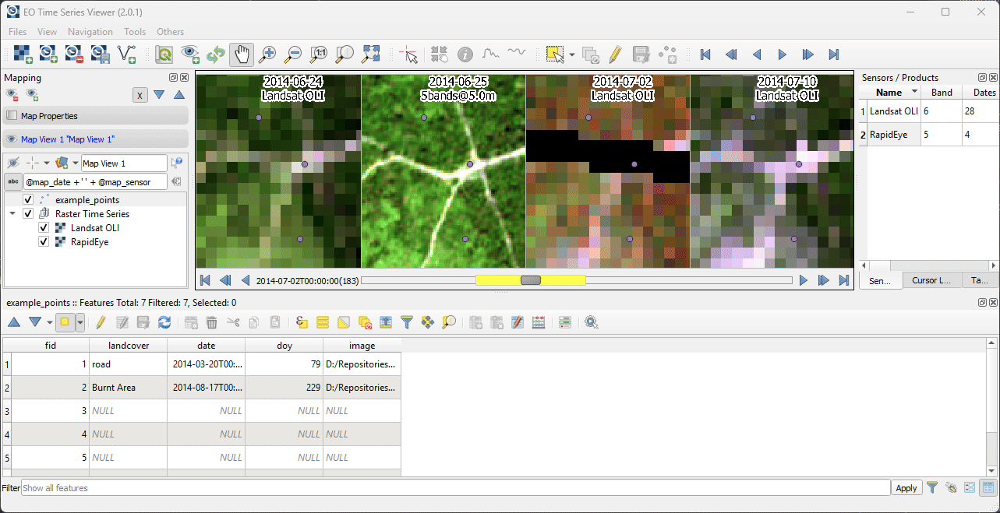

.. _quick_labeling:

==============
Quick Labeling
==============

The EO Time Series Viewer assists you in describing, i.e. *label* reference data.
Whether your locations (vector point, lines or polygons) already exist, or need to be digitized
on a visualized maps, in both cases you want to describe them with individual attributes.
Such attributes can be of different type. For example land cover labels (*landcover='pasture'*)
time stamps that indicate a change event (*deforestation='2024-04-03'*), or numeric values (*soil_fraction=0.3*).

The EO Time Series Viewer supports this with "Quick Label" short-cuts. If triggered, they send
fill values into one or multuple attribute cells of selected vector features. Such features could be the points or
polygons of a vector layer, that have been selected in a map, an attribute table, or a temporal profile plot
:ref:`temporal profile plot <temporal_profile_plot>`.

    Quick Label Workflow, using the map canvas contex menu

Shortcuts
=========

The following table shows the quick label types that you can setup to fill in attribute values.

.. list-table::
    :header-rows: 1

    * - Type
      - Supported Field Types
      - Description

    * - Off
      - Any
      - Does nothing. Useful to pause quick labeling

    * - Date
      - String, Date
      - Date taken from the map canvas or cursor position of time series plot

    * - DateTime
      - String, DateTime
      - Date-Time stamp taken from the map canvas date or cursor position of time series plot

    * - Time
      - String, Time
      - Time stamp taken from the map canvas date or cursor position of time series plot

    * - DOY
      - String, Integer
      - Day of year taken from the map canvas date or cursor position of time series plot

    * - Year
      - String, Integer
      - Year taken from the map canvas date or cursor position of time series plot

    * - DecimalYear
      - String, Float
      - Decimal year value taken from the map canvas date or cursor position of time series plot

    * - Sensor
      - String
      - Name of sensor (as defined in the sensor panel) relating to the observation that is shown in the map canvas

    * - SourceImage
      - String
      - Path of raster observation that is shown below the mouse cursor

    * - Customized
      - String
      - Value returned from the evaluation of a user defined expression.

    * - Classification
      - String, Integer
      - Class name or label number, selectable from context menu

Example
=======

Start the EO Time Series Viewer and open the example data (*Files > Add example*).
The layer tree contains now an *example_points* layer. Use the context menu to open its layer properties.

The *example_points.geojson* has five fields of different data types. We like to use them
to store the following values:

.. list-table::
    :header-rows: 1

    * - Field
      - Expected Values

    * - landcover
      - A landcover label like `forest`, `deforestation`, `water`, `burnt area` or `pasture`

    * - date
      - The observation date on which we observed the landcover.

    * - doy
      - The day-of-year of the observation date, as integer number.

    * - Image
      - The path of the raster image in which we observed the landcover.

    Layer properties with *Fields* page

The *Attribute Form* is used to setup the *Quick Labeling* short-cuts.
Select the *landcover* field, set the *Widget Type* combobox to *EOTSV Quick Label* and then the
*Type* combobox to *Classification*. The classification widgets allows you to define a classification scheme.
Each class has a numeric label, a name and a color.

    Layer property *Attributes Form* with quick label classification
    activated for the *classification* field.

Now set the other fields to the following quick label types:

.. list-table::
    :header-rows: 1

    * - Field
      - Widget Type
      - Quick Label Type

    * - landcover
      - EOTSV Quick Label
      - Classification

    * - date
      - EOTSV Quick Label
      - DateType

    * - doy
      - EOTSV Quick Label
      - DOY

    * - image
      - EOTSV Quick Label
      - SourceImage

    Layer property *Attributes Form*, having the quick label source image path
    activated for the *image* field.

When done, *Apply* the changes and click *Ok* to close the layer settings.
Now we are ready to use quick labeling shortcuts. To see how they fill in attribute values,
open the attribute table of the *example_points* layer.

Now use the the map visualization and the toolbar identify the landcover for selected points.
Using the context menu of a map, the derived quick label information can be written directly in
The attributes of the selected points. They do not have to be entered individually
into the attribute table. Using the |mActionArrowDown| and |mActionArrowUp| buttons
selects the next (or previous) vector feature and pans the maps too.

    Quick labels are set from the map context menu. Attributes are derived from the
    map observation date or map layers and written into the attributes of selected
    vector features.

Groups
======

tbd.

.. AUTOGENERATED SUBSTITUTIONS - DO NOT EDIT PAST THIS LINE

.. |mActionArrowDown| image:: /icons/mActionArrowDown.png
   :width: 28px
.. |mActionArrowUp| image:: /icons/mActionArrowUp.png
   :width: 28px
