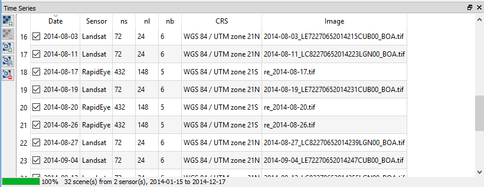
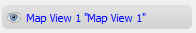
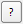

.. DEFINE ICONS AND IMAGE HERE

.. include:: /icon_links.rst

.. |cbc| image:: img/checkbox_checked.png
.. |cbu| image:: img/checkbox_unchecked.png

===========
Quick Start
===========

1. Click |icon| in the QGIS Tool Bar or via :menuselection:`Raster --> EO Time Series Viewer` to start the EO Time Series Viewer

2. Click :menuselection:`Files --> Add example` to load an exemplary time series of Landsat and RapidEye observations.

   Open the sensor panel :menuselection:`View --> Panels... --> Sensors / Products` and change the sensor names

   ============ =========
   Default      Changed
   ============ =========
   6bands@30.0m Landsat
   5bands@5.0m  RapidEye3
   ============ =========

   The change of sensor names becomes visible in other other parts of the GUI as well, e.g. the
   list of time series source images.

4. Use the scroll band and the map tools  |mActionZoomIn| |mActionZoomOut| |mActionPan| to change the temporal and spatial subset shown from the time series.

5. Open the Mapping panel, change the map view name from `Map View 1` to `True Color` and set the multiband color render
   band selection to `RGB = 3-2-1` for both, Landsat and RapidEye images (right-click on layer, :menuselection:`Set Properties --> Style`).

.. note:: Use |mActionRefresh| to refresh or redraw related maps, spectral profile plots etc.

6. Now we like to optimize the color stretch. Choose a -clouded Landsat observation like 2014-06-24 and use the map context menu (right-mouse-click)
   to click on :menuselection:`Stretch to current extent ... --> Linear 5%`. Repeat with `Linear` and `Gaussian` stretch as well as for RapidEye images to
   see how this changes the band-specific min/max values in the Map View settings.

7. Click |mActionAddMapView| to create a second map view, respectively row of map images. Call it ``Short-Wave IR`` and the the multiband color render bands to
   *Landsat RGB = 4-5-3* and *RapidEye RGB = 5-4-3*

8. Expand the :guilabel:`Map Properties` combobox (in the Mapping panel), increase the map size to 300x300 pixel and press :guilabel:`Apply`.

9. Bring the Temporal Profile panel :menuselection:`View --> Panels... --> Sensors / Products` and the `2D` page to the front.
   Click |mIconTemporalProfile| and select a map location to visualize the temporal profile for.
   Each selected map location will be listed in the panels |mActionOpenTable| :guilabel:`Coordinate` page.

   Go back to the `2D` plot page and add a second profile with RapidEye data as Sensor source.
   Change the expression field to show the Normalized Difference Vegetation Index (NDVI) for both sensors:

   ======== ================
   Sensor   Expression NDVI
   ======== ================
   Landsat  (b4-b3)/(b4+b3)
   RapidEye (b5-b3)/(b5+b3)
   ======== ================
