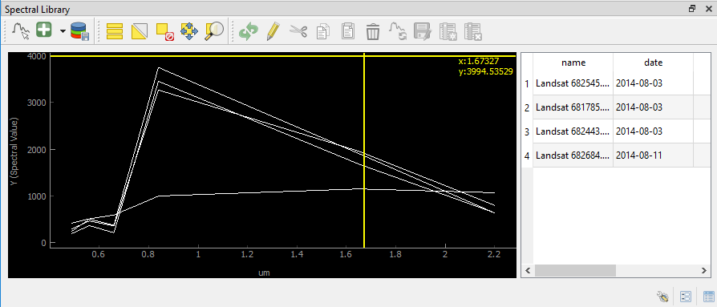

.. _spectral_profiles:

Spectral Profiles
=================

.. warning::
    This section is outdated and currently being revised.

The spectral profile panel allows you to collect, visualize, label and export spectral profiles.

* Use the |pickrasterspectrum| :superscript:`Select a spectrum from a map` button to extract and visualize a pixels profile
  (by clicking on a pixel on the map).
* You can add a selected spectrum to your spectral library by clicking on |profile2speclib|.
* The gathered spectra are listed in the table on the right. For every spectrum additional metadata will be stored, e.g.
  the date, day of year and sensor.
* When the |profile2speclib_auto| button is activated, the profile will be directly added to the library after clicking on a pixel.
* Change the display style (color, shape, linetype) in the Spectral Library Properties, which can be accessed via the |action| button in the lower right.

.. note::
    The spectral library table behaves quite similar to the attribute table you know from QGIS:
        * You can edit the content by entering the editing mode |mActionToggleEditing|
        * You can add further information by adding fields via the |mActionNewAttribute| button (e.g. different class labels).
          Remove them with |mActionDeleteAttribute|, accordingly.
        * Double-click into a desired field to change its content
        * Remove spectra by selecting the desired row(s) in the table and click |mActionDeleteSelected|

.. AUTOGENERATED SUBSTITUTIONS - DO NOT EDIT PAST THIS LINE

.. |action| image:: /icons/action.png
   :width: 28px
.. |mActionDeleteAttribute| image:: /icons/mActionDeleteAttribute.png
   :width: 28px
.. |mActionDeleteSelected| image:: /icons/mActionDeleteSelected.png
   :width: 28px
.. |mActionNewAttribute| image:: /icons/mActionNewAttribute.png
   :width: 28px
.. |mActionToggleEditing| image:: /icons/mActionToggleEditing.png
   :width: 28px
.. |pickrasterspectrum| image:: /icons/pickrasterspectrum.png
   :width: 28px
.. |profile2speclib| image:: /icons/profile2speclib.png
   :width: 28px
.. |profile2speclib_auto| image:: /icons/profile2speclib_auto.png
   :width: 28px
