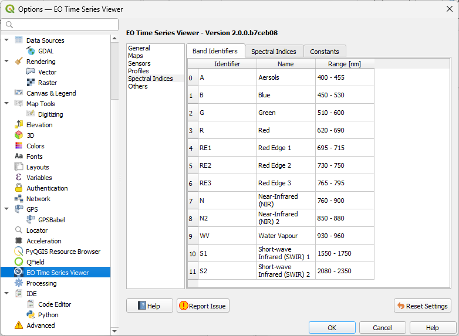

.. _temporal_profiles:

=================
Temporal Profiles
=================

Loading
=======

Temporal profiles can be loaded (a) interactively with the *cursor location info* tool, or
(b) for point locations that are defined in a vector layer, using the
*read temporal profiles* processing algorithms.

a) To load a single temporal profile *on-the-fly*, activate the *identify cursor location value* tool
|select_location| with option *collect temporal profiles* |mIconTemporalProfile|. Then click with the mouse
on a map location of interest to extract the temporal profile for. If no other vector layer exists, the loaded profile will be added to a new created in-memory vector layer
and visualized in the temporal profile view.

    Collecting temporal profiles.

b) The :ref:`*read temporal profiles* <qpa-readtemporalprofiles>` processing algorithm loads temporal profiles
for multiple point locations. It can be started from menu bar *Tools* -> *Read Temporal Profiles* or the QGIS processing toolbox:

.. figure:: img/gui_qpa_read_tp.png

Data Structure
==============

To visualize a time series in a plot window, the EO Time Series Viewer first extracts the multi-band and multi-sensor
time series of the requested point locations. For a single point, the data related to a time series of length *n*
is stored in a JSON struct that contains:

- a list ``date`` with *n* observation date items. Each date item is represented
  by an date-time string in `ISO 8601 <https://en.wikipedia.org/wiki/ISO_8601>`_ format,
- a list ``values`` with *n* value lists. Each value item is a list of raster band values in band order, i.e. the
  *pixel profile* that was observed at observation date\ :sub:`i` at the point location,
- a list ``sensor`` with *n* sensor index values *s*, with *0 <= s < number of sensor_ids*,
- a list with *s >= 1* ``sensor_ids``, one for each sensor the time series was observed by,
- a single sensor id is dictionary or its JSON string that contains the following key-value pairs:

    - ``nb`` (integer) number of bands
    - ``px_size_x`` (float) pixel resolution in x direction
    - ``px_size_y`` (float) pixel resolution in y direction
    - ``dt`` (integer) raster data type as _`Qgis::DataType <https://api.qgis.org/api/classQgis.html#a99509074b35d33f9ce7addf3a07be051>`_
      value
    - ``wl`` (optional) a list of *nb* float values with the band wavelengths
    - ``wlu`` (optional) a string value that describes the wavelength unit, e.g. ``nm`` or ``μm``
    - ``name`` (optional) a sensor name, e.g. ``Landsat 8`` or ``Sentinel-2``

The following is a temporal profile JSON struct taken from the EO Time Series Viewer example data (*Files > Add Example*)

.. code-block:: json

    {"date":
        ["2014-01-15T00:00:00", "2014-03-20T00:00:00", "2014-04-21T00:00:00", "2014-04-29T00:00:00", "2014-05-07T00:00:00", "2014-05-15T00:00:00", "2014-05-23T00:00:00", "2014-05-31T00:00:00", "2014-06-08T00:00:00", "2014-06-16T00:00:00", "2014-06-24T00:00:00", "2014-06-25T00:00:00", "2014-07-02T00:00:00", "2014-07-10T00:00:00", "2014-07-26T00:00:00", "2014-08-03T00:00:00", "2014-08-11T00:00:00", "2014-08-17T00:00:00", "2014-08-19T00:00:00", "2014-08-20T00:00:00", "2014-08-26T00:00:00", "2014-08-27T00:00:00", "2014-09-12T00:00:00", "2014-09-20T00:00:00", "2014-09-28T00:00:00", "2014-10-06T00:00:00", "2014-10-14T00:00:00", "2014-11-07T00:00:00", "2014-11-15T00:00:00", "2014-12-17T00:00:00"],
     "sensor":
        [0, 0, 0, 1, 0, 1, 0, 1, 0, 1, 0, 2, 1, 0, 0, 1, 0, 2, 1, 2, 2, 0, 0, 1, 0, 1, 0, 1, 0, 0],
     "sensor_ids": [
        "{\"nb\": 6, \"px_size_x\": 30.0, \"px_size_y\": 30.0, \"dt\": 3, \"wl\": [0.49, 0.56, 0.66, 0.84, 1.65, 2.2], \"wlu\": \"micrometers\", \"name\": \"Landsat OLI\"}",
        "{\"nb\": 6, \"px_size_x\": 30.0, \"px_size_y\": 30.0, \"dt\": 3, \"wl\": [0.49, 0.56, 0.66, 0.84, 1.65, 2.2], \"wlu\": \"micrometers\", \"name\": \"Landsat ETM+\"}",
        "{\"nb\": 5, \"px_size_x\": 5.0, \"px_size_y\": 5.0, \"dt\": 2, \"wl\": null, \"wlu\": null, \"name\": null}"
        ],
    "values": [
        [736.0, 1024.0, 1077.0, 4272.0, 2472.0, 1678.0],
        [769.0, 942.0, 763.0, 4345.0, 2138.0, 1043.0],
        [3894.0, 3993.0, 3916.0, 5516.0, 3799.0, 2876.0],
        [3307.0, 3440.0, 3436.0, 5822.0, 4161.0, 3220.0],
        [100.0, 210.0, 105.0, 1926.0, 798.0, 405.0],
        [640.0, 752.0, 595.0, 3822.0, 1725.0, 773.0],
        [3501.0, 3567.0, 3432.0, 4936.0, 3179.0, 2364.0],
        [242.0, 350.0, 216.0, 4046.0, 1606.0, 608.0],
        [146.0, 223.0, 122.0, 1907.0, 654.0, 244.0],
        [242.0, 361.0, 220.0, 3763.0, 1704.0, 615.0],
        [179.0, 356.0, 207.0, 3935.0, 1716.0, 617.0],
        [4573.0, 3682.0, 1944.0, 3504.0, 9692.0],
        [228.0, 415.0, 287.0, 3886.0, 1782.0, 677.0],
        [209.0, 405.0, 268.0, 3949.0, 1686.0, 668.0],
        [202.0, 400.0, 253.0, 3522.0, 1764.0, 715.0],
        [221.0, 412.0, 272.0, 3371.0, 1840.0, 724.0],
        [368.0, 534.0, 627.0, 1911.0, 1691.0, 1072.0],
        [7177.0, 5285.0, 4496.0, 4081.0, 4486.0], 
        [669.0, 739.0, 768.0, 1795.0, 1921.0, 1457.0], 
        [8686.0, 6353.0, 5231.0, 4679.0, 4948.0], 
        [7187.0, 5676.0, 4295.0, 3733.0, 4332.0], 
        [410.0, 567.0, 720.0, 1832.0, 2111.0, 1432.0], 
        [328.0, 467.0, 562.0, 1613.0, 2195.0, 1596.0], 
        [1667.0, 1640.0, 1632.0, 2849.0, 1854.0, 1444.0], 
        [949.0, 1313.0, 1466.0, 2943.0, 3292.0, 2392.0], 
        [1002.0, 1132.0, 1120.0, 2951.0, 2732.0, 1730.0], 
        [288.0, 552.0, 626.0, 2189.0, 2440.0, 2198.0],
        [1448.0, 1662.0, 1688.0, 3874.0, 2997.0, 1932.0],
        [133.0, 229.0, 173.0, 1100.0, 645.0, 330.0],
        [387.0, 685.0, 662.0, 3231.0, 1775.0, 1088.0]
        ]
    }

.. note::

    Storing the *entire* temporal profile, including observations from all bands and different sensors,
    makes it possible to analyze different bands or spectral indices in parallel, without the need for a
    a new loading process.

The EO Time Series Viewer can store such JSON formatted temporal profile in any vector layer that supports
string fields of unlimited length (most vector formats). Even better are formats that support
JSON data types, like a GeoPackage. To use a vector layer field for temporal profiles requires to
set its editor widget type to "Temporal Profile".

    Vector layer properties dialog with Attributes Form. The widget type of the
    "profiles" field is set to "Temporal Profiles".

Visualization
=============

Temporal profiles are visualized in the *Temporal Profile View* widget. If not already done, you can open it via
*Menu Bar -> View -> Temporal Profiles*. The widget has a toolbar, a settings and a plot area
(use the cursor to highlight them in the following image).

.. raw:: html

    <svg width="840" height="400" style="display: block; position: relative;">
      <defs>
        <filter x="0" y="0" width="1" height="1" id="text_bg">
          <feFlood flood-color="white" result="bg" />
          <feMerge>
            <feMergeNode in="bg"/>
            <feMergeNode in="SourceGraphic"/>
          </feMerge>
        </filter>
      </defs>

        <image href="_static/img/temporal_profile_panel.png" x="0" y="0"
            width="824" height="355" />

          <g class="svg-hover-group">
            <a href="temporal_profiles.html#tool-bar">
                <title>Tool Bar</title>
                <rect x="0" y="25" width="824" height="29" />
                <text "url(#text_bg)" x="325" y="45">Tool Bar</text>
            </a>
            </g>

          <g class="svg-hover-group">
            <a href="temporal_profiles.html#settings-panel">
                <title>Settings Panel</title>
                <rect x="0" y="55" width="258" height="301" />
                <text filter="url(#text_bg)"
                      x="100" y="75">Settings Panel</text>
            </a></g>

          <g class="svg-hover-group">
            <a href="temporal_profiles.html#profile-plot-panel">
                <title>Profile Plot Panel</title>
                <rect x="260" y="55" width="565" height="301" />
                <text filter="url(#text_bg)"
                      x="550" y="250">Profile Plot Panel</text>
            </a></g>

    </svg>

Tool Bar
--------

The toolbar allows to access the following actions:

.. list-table::
    :widths: 8 100
    :header-rows: 1

    * - Icon
      - Action
    * - |mActionAdd|
      - Add temporal profile candidates permanently to the vector layer
    * - |mActionAddMapView|
      - Create a new profile view
    * - |mActionRemoveMapView|
      - Remove selected profile views
    * - |mActionReload|
      - Reload / refresh the plot
    * - |mActionShowSelectedLayers|
      - Show only profiles whose vector layer feature are selected, for example in the map visualization or the an attribute table.
    * - |mActionFileSaveAs|
      - Save changes to the vector layer
    * - |mActionPanToSelected|
      - Pan the map visualization to the coordinates of selected temporal profiles
    * - |mActionZoomToSelected|
      - Zoom the map visualization to the coordinates of selected temporal profiles
    * - |mActionDeselectActiveLayer|
      - Deselect selected temporal profiles
    * - |attributes|
      - Open the attribute table to show the vector layer features for temporal profile layer selected in the settings table

Settings Panel
--------------

The settings panel controls which and how temporal profiles are visualized.
It allows to define one or more *profile views*

    The settings panel with one profile view to visualize the temporal profiles that are store in the attribute field *profiles* of
    the vector layer "Temporal Profiles". The temporal profiles contain Landsat and RapidEye observations, whose visualization
    is handled separately.

A *profile view* defines:

* the *vector layer* and the vector layer *field* that contain the temporal profile data
* the line-style that is used to plot the profiles
* *(optionally)* a name that is given to the plotted profiles.
* *(optionally*) a filter to plot only profile that match with specific vector layer attributes

* for each sensor the profiles have observations from:

    * a point symbol, e.g. differentiate observations made by different satellites
    * a *python expression* to select the required band values or calculate a spectral index to be plotted.

    The python expression dialog to define the formula that calculate sensor specific band values or spectral indices

In the sensor-specific python expressions the ``b(...)`` function is used to extract the band values as numpy array.
These arrays can be used to define the formula to calculate the final plot values.
If band wavelength and wavelength units are defined for the sensor, the ``b(...)`` function can be used with
string inputs, like a band identifier or a spectral index acronym.

.. list-table::
    :widths: 50 100
    :header-rows: 1

    * - Example
      - Description
    * - ``b(1)``
      - return the values of the 1st band
    * - ``b(1) * 100``
      - return the values of the 1st band, scaled by factor 100
    * - ``b('N')``
      - returns the value of the near-infrared band (see settings)
    * - ``(b(4) - b(3))/(b(4) + b(3))``
      - returns the NDVI values for Landsat 8 legacy bands
    * - ``(b('N') - b('R'))/(b('N') + b('R'))``
      - returns the NDVI values, requires that wavelength information is provided for the sensor
    * - ``b('NDVI')``
      - returns the NDVI values, requires that wavelength information is provided for the sensor

The band identifiers and spectral index definitions are taken from the
`Awesome Spectral Index project <https://awesome-ee-spectral-indices.readthedocs.io/en/latest/list.html>`_
You can inspect them in the EO Time Series Viewer settings (*Others > Settings*):
For checked indices in the settings list, the profile view context menu will show a shortcut to set it in the
python expression field.

    EO Time Series Viewer Settings for spectral indices, list of band identifiers.

    EO Time Series Viewer Settings for spectral indices, spectral index definitions.
    Because NDVI and EVI are checked, they do appear as shortcuts in the context menu of the
    profile view (shown next figure).

    The profile view context menu allows to active spectral indices fast.

Profile Plot Panel
------------------

The profile plot visualizes the profiles as defined in the profile views of the settings panel.
The range of the x and y axis can be freely adjusted. To restore the default axis values, move the cursor to the
the lower-left corner of the plot and click the click the [A] symbol.

A left-mouse click on a profile will select the corresponding vector feature, e.g. in the map visualization or an attribute table.
Similar, you may select feature there to get the corresponding temporal profiles highlighted.

The plot context menu allows to move the window of visualized maps (see map visualization) to the observation date of
the last hovered data point.

.. figure:: img/temporal_profiles_plotting.gif

    Changing axis ranges and selecting vector features by selecting them in the profile plot.

.. AUTOGENERATED SUBSTITUTIONS - DO NOT EDIT PAST THIS LINE

.. |attributes| image:: /icons/attributes.png
   :width: 28px
.. |mActionAdd| image:: /icons/mActionAdd.png
   :width: 28px
.. |mActionAddMapView| image:: /icons/mActionAddMapView.png
   :width: 28px
.. |mActionAddOgrLayer| image:: /icons/mActionAddOgrLayer.png
   :width: 28px
.. |mActionDeselectActiveLayer| image:: /icons/mActionDeselectActiveLayer.png
   :width: 28px
.. |mActionFileSave| image:: /icons/mActionFileSave.png
   :width: 28px
.. |mActionFileSaveAs| image:: /icons/mActionFileSaveAs.png
   :width: 28px
.. |mActionOpenTable| image:: /icons/mActionOpenTable.png
   :width: 28px
.. |mActionPanToSelected| image:: /icons/mActionPanToSelected.png
   :width: 28px
.. |mActionReload| image:: /icons/mActionReload.png
   :width: 28px
.. |mActionRemove| image:: /icons/mActionRemove.png
   :width: 28px
.. |mActionRemoveMapView| image:: /icons/mActionRemoveMapView.png
   :width: 28px
.. |mActionShowSelectedLayers| image:: /icons/mActionShowSelectedLayers.png
   :width: 28px
.. |mActionZoomToSelected| image:: /icons/mActionZoomToSelected.png
   :width: 28px
.. |mIconTemporalProfile| image:: /icons/mIconTemporalProfile.png
   :width: 28px
.. |mIconTemporalProfile2D| image:: /icons/mIconTemporalProfile2D.png
   :width: 28px
.. |mIconTemporalProfileRefresh| image:: /icons/mIconTemporalProfileRefresh.png
   :width: 28px
.. |select_location| image:: /icons/select_location.png
   :width: 28px
