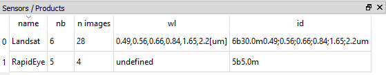

===========
Time Series
===========

The EO Time Series Viewer visualizes a time series of raster images,
that is listed in the *time series panel*:

1. *Time Series Sources*, i.e. raster images. They need to be readable by QGIS/GDAL
   and each source needs to provide a timestamp - the observation data - , e.g in the filename or GDAL metadata.

2. *Sensors/Products*, e.g, *Landsat 8*, *Sentinel-2* or *NDVI* images.
   Each time series source is linked to a sensor.
    Time series sources created by the same sensors have:

        - the same number of bands
        - the same pixel size
        - if defined, the same band wavelength definition
        - if defined, the same sensor/product name

    It is assumed that images with the same spectral properties and pixel size
    have been created by the same sensor and can be handled in the same way.
    For example, if we like to change the displayed band combination,
    we like to set it for all time series sources from the same sensor.

3. *Time Series Dates*. A time series date is an observation date, i.e. timestamp,
that is used to group sources from the same sensor, but with potentially
differing time stamps.

For example, the Sentinel-2 observations recorded on the same orbit overpass
show a progressive increase of time stamps. However, by using the Date-Time Precission of a "Day"
all Sentinel-2 observations from the same day will be grouped to the same time series date.

Time Series Panel
=================

This window lists the individual input raster files of the time series.

.. figure:: img/timeseriespanel.png

* **Date** corresponds to the image acquisition date as automatically derived by the EO TSV from the file name. Checking |cbc| or unchecking |cbu| the box in the date field will include or exclude the respective image from the display
* **Sensor** shows the name of the sensor as defined in the :ref:`Sensors / Products` tab
* **ns**: number of samples (pixels in x direction)
* **nl**: number of lines (pixels in y direction)
* **nb**: number of bands
* **image**: path to the raster file

You can add new rasters to the time series by clicking |mActionAddRasterLayer| :superscript:`Add image to time series`.
Remove them by selecting the desired rows in the table (click on the row number) and pressing the |mActionRemoveTSD| :superscript:`Remove image from time series` button.

.. tip::

   If you have your time series available as one large raster stack, you can import this file via :menuselection:`Files --> Add images from time stack`

.. tip:: Click :menuselection:`Files --> Add example` to load a small example time series.

Sensors / Products
==================

The EO Time Series Viewer automatically assesses different characteristics of the input images (number of bands, geometric resolution etc.)
and combines identical ones into sensor groups (or products). Those are listed as follows in the Sensor / Products window:

* ``name`` is automatically generated from the resolution and number of bands (e.g. *6bands@30.m*). This field is adjustable,
  i.e. you can change the name by double-clicking into the field. The here defined name will be also displayed in the Map View and the Time Series table.
* ``nb``: number of bands
* ``n images``: number of images within the time series attributed to the according sensor
* ``wl``: comma separated string of the (center) wavelength of every band and [unit]
* ``id``: string identifying number of bands, geometric resolution and wavelengths (primary for internal use)

|
