.. DEFINE ICONS AND IMAGE HERE

.. |cbc| image:: img/checkbox_checked.PNG
.. |cbu| image:: img/checkbox_unchecked.PNG
.. |ad_ra| image:: ../../eotimeseriesviewer/ui/icons/mActionAddRasterLayer.svg
    :width: 27px
.. |re_ra| image:: ../../eotimeseriesviewer/ui/icons/mActionRemoveTSD.svg
    :width: 27px
.. |timeseriesdock| image:: img/timeseriesdock.png

.. |icon_zoom_in| image:: ../../eotimeseriesviewer/ui/icons/mActionZoomIn.svg
    :width: 27px
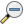
.. |icon_zoom_pan| image:: ../../eotimeseriesviewer/ui/icons/mActionPan.svg
    :width: 27px
.. |icon_zoom_full| image:: ../../eotimeseriesviewer/ui/icons/mActionZoomFullExtent.svg
    :width: 27px
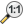

.. |spectral_profile| image:: ../../eotimeseriesviewer/ui/icons/pickrasterspectrum.svg
    :width: 27px

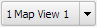
.. |questionmark| image:: img/questionmark.png
.. |hidemapview| image:: ../../eotimeseriesviewer/ui/icons/mapviewHidden.svg
    :height: 27px
    :width: 27px
.. |crosshair| image:: ../../eotimeseriesviewer/ui/icons/crosshair.svg
    :height: 27px
    :width: 27px
.. |symbology| image:: ../../eotimeseriesviewer/ui/icons/symbology.svg
    :height: 27px
    :width: 27px
.. |copy| image:: ../../eotimeseriesviewer/ui/icons/mActionEditCopy.svg
.. |paste| image:: ../../eotimeseriesviewer/ui/icons/mActionEditPaste.svg

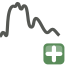
.. |addattribute| image:: img/qgis_icons/mActionNewAttribute.svg
    :width: 27px
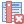

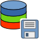

==========
User Guide
==========

.. note:: This documentation reflects the previous EO Time Series Viewer version, where some parts of the GUI looked
          different. We are working hard on updating the figures and descriptions.

Quick Start
-----------

1. Click |icon_eotsv| in the QGIS Tool Bar or via :menuselection:`Raster --> EO Time Series Viewer` to start the EO Time Series Viewer

2. Click :menuselection:`Files --> Add example` to load an examplary time series of Landsat and RapidEye observations.

3. Open the sensor panel :menuselection:`View --> Panels... --> Sensors / Products` and change the sensor names

    ============ =========
    Default      Changed
    ============ =========
    5bands@5.0m  RapidEye
    6bands@30.0m Landsat
    ============ =========

4. Use the scroll band and the map tools  |icon_zoom_in| |icon_zoom_out| |icon_zoom_pan| to change the temporal and spatial subset shown from the time series.

5. Open the Map View panel, change the map view name from `Map View 1` to `True Color` and set the multiband color render band selection to `RGB = 3-2-1` for both, Landsat and RapidEye images.

.. note:: Use |refresh| to refresh or redraw related maps, spectral profile plots etc.

6. Now we like to Optimize the color stretch. Choose a none-clouded Landsat observation like 2014-06-24 and use the map context menu (right-mouse-click)
   to click on :menuselection:`Stretch to current extent ... --> Linear 5%`. Repeat with `Linear` and `Gaussian` stretch as well as for RapidEye images to
   see how this changes the band-specific min/max values in the Map View settings.

7. Click |icon_add_map_view| to create a second map view, respectively row of map images. Call it `Short-Wave IR` and the the multiband color render bands to
   ``Landsat RGB = 4-5-3`` and ``RapidEye RGB = 5-4-3``

8. Expand the `Map Properties` combobox (the first in the Map Views panel), increase the map size to 300x300 pixel and press `Apply`.

9. Bring the Temporal Profile panel :menuselection:`View --> Panels... --> Sensors / Products` and the `2D` page to the front.
   Click |icon_select_ts_profile| and select a map location to visualize the temporal profile for.
   Each selected map location will be listed in the panels' `Coordinate` page.

   Go back to the `2D` plot page and add a second profile with RapidEye data as Sensor source.
   Change the expression field to show the Normalized Difference Vegetation Index (NDVI) for both sensors:

   ======== ================
   Sensor   Expression NDVI
   ======== ================
   Landsat  (b4-b3)/(b4+b3)
   RapidEye (b5-b3)/(b5+b3)
   ======== ================

|

....

|

The Graphical User Interface
----------------------------

.. figure:: img/interface.png

    This is what the EO Time Series Viewer's interface looks like when opening it.

.. note:: Just like in QGIS, many parts of the GUI are adjustable panels. You can arrange them as tabbed, stacked or separate windows.
          Activate/Deactivate panels under :menuselection:`View --> Panels`

|

Time Series
^^^^^^^^^^^

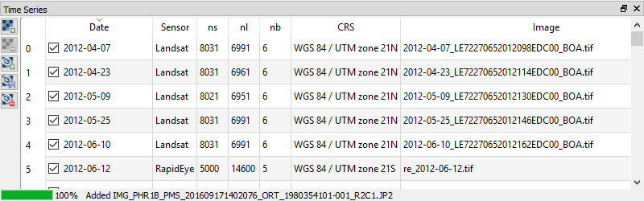

This window lists the individual input raster files of the time series.

* ``date`` corresponds to the image acquisition date as automatically derived by the EO TSV from the file name. Checking |cbc| or unchecking |cbu| the box in the date field will include or exclude the respective image from the display
* ``sensor`` shows the name of the sensor as defined in the :ref:`Sensors / Products` tab
* ``ns``: number of samples (pixels in x direction)
* ``nl``: number of lines (pixels in y direction)
* ``nb``: number of bands
* ``image``: path to the raster file

You can *add new rasters* to the time series by clicking |ad_ra| :superscript:`Add image to time series`.
Remove them by selecting the desired rows in the table (click on the row number) and pressing the |re_ra| :superscript:`Remove image from time series` button.

.. tip:: Click :menuselection:`Files --> Add example` to load a small example time series.

|

Sensors / Products
^^^^^^^^^^^^^^^^^^

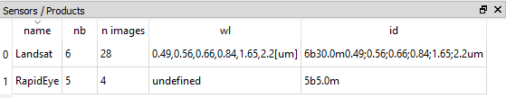

The EO Time Series Viewer automatically assesses different characteristics of the input images (number of bands, geometric resolution etc.)
and combines identical ones into sensor groups (or products). Those are listed as follows in the Sensor / Products window:

* ``name`` is automatically generated from the resolution and number of bands (e.g. *6bands@30.m*). This field is adjustable,
  i.e. you can change the name by double clicking into the field. The here defined name will be also displayed in the Map View and the Time Series table.
* ``nb``: number of bands
* ``n images``: number of images within the time series attributed to the according sensor
* ``wl``: comma separated string of the (center) wavelength of every band and [unit]
* ``id``: string identifying number of bands, geometric resolution and wavelengths (primary for internal use)

|

The Toolbar
^^^^^^^^^^^

============================================ ===========================================================================
Button                                       Function
============================================ ===========================================================================
|ad_ra|                                      Add Raster Layer
|addTS|                                      Add Time Series from CSV
|remTS|                                      Remove all images from Time Series
|saveTS|                                     Save Time Series as CSV file
|icon_add_map_view|                          Add maps that show a specified band selection
|refresh|                                    Refresh maps
|zoompoint|                                  Select center coordinate
|icon_zoom_in|                               Zoom into map
|icon_zoom_out|                              Zoom out
|icon_zoom_full|                             Zoom to maximum extent of time series
|icon_zoom_11|                               Zoom to pixel scale
|icon_zoom_pan|                              Pan map
|extentimport|                               Set spatial map extent from QGIS map canvas
|centerimport|                               Set spatial map center from QGIS map canvas
|extentexport|                               Set map extent to QGIS map canvas
|centerexport|                               Set map center to QGIS map canvas
|identify|                                   Identify map layers (cursor location info)
|icon_select_ts_profile|                     Identify pixel time series for specific coordinate
|spectral_profile|                           Select pixel profiles from map
|info|                                       About the plugin
============================================ ===========================================================================

|

Map Visualization
^^^^^^^^^^^^^^^^^

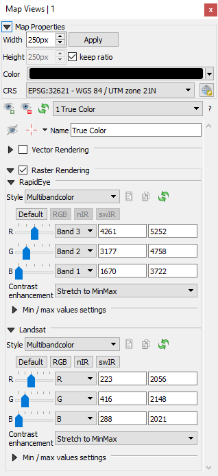

Map Properties
..............

In the map properties box you can specify **Width** and **Height**, as well as background **Color** and the **CRS** of the single map canvases.
Click :guilabel:`Apply` to apply changes. By default the **keep ratio** option is |cbc| checked, i.e. height will be the same as width. In case
you want to have unequally sized views, deactivate this option.

.. .. image:: img/maprendering.png

.. * :guilabel:`Set Center` center the QGIS Map View to the same coordinate as the EO TSV Map View
.. * :guilabel:`Get Center` center the EO TSV Map View to the same coordinate as the QGIS Map View
.. * :guilabel:`Set Extent` zoom the QGIS Map View to the same extent as the EO TSV Map View
.. * :guilabel:`Get Extent` zoom the EO TSV Map View to the same extent as the QGIS Map View
.. * ``Load center profile``, when checked |cbc|, the temporal profile of the center pixel will automatically be displayed and updated in the :ref:`Profile View` tab.

Map Views
.........

A map view is a row of map canvases that show the time series images of different sensors/product in the same band combination, e.g. as "True Color bands".
The map view panel allows to add or remove map views and to specifiy how the images of each sensor are to be rendered.

* You can *add new Map Views* using the |icon_add_map_view| button. This will create a now row of map canvases. Remove a map view via |removemapview|.
* In case the Map View does not refresh correctly, you can 'force' the refresh using the |refresh| button (which will also apply all the render settings).
* Access the settings for individual Map Views via the dropdown menu |mapviewdropdown|
* You can use the |questionmark| button to *highlight the current Map View* selected in the dropdown menu (respective image chips will show red margin for a few seconds).

Now, for every Map View you can alter the following settings:

* *Hide/Unhide* the Map View via the |hidemapview| :superscript:`Toggle visibility of this map view` button.

* *Activate/Deactivate Crosshair* via the |crosshair| :superscript:`Show/hide a crosshair` button. Press the arrow button next to it to enter
  the *Crosshair specifications* |symbology| , where you can customize e.g. color, opacity, thickness, size and further options.

* You may rename the Map View by altering the text in the ``Name`` field.

* **Vector Rendering** allows you to visualize vector data (e.g. a shapefile). In order to do so, open the file in QGIS. Once loaded in the QGIS Layers Panel, it will become selectable
  in the dropdown menu. Vector styling will be same as in QGIS (i.e. if you want to adjust it, do it in QGIS). Check |cbc| or uncheck |cbu| in order to activate/deactivate Vector Rendering.
  Furthermore, you can visualize the locations of :ref:`Temporal Profiles` or :ref:`Spectral Profiles <Spectral Library>` as points. Select the desired option
  from the dropdown list.

* Under **Raster Rendering** you can adjust the visualisation of the raster layers. Every sensor, as specified in the :ref:`Sensors / Products` tab, has its separate
  rendering option section (since band specifications differ among sensors). The handling is very similar to the QGIS style options.

        * Multiband (RGB) as well as singleband rendering is supported. Select the desired mode in the dropdown menu.

        * Select the desired band(s) for display using the slider or dropdown list. In the dropdown menu at the bottom you can specify the contrast enhancement to be used for the value stretch.
          In case EO TSV has sufficient wavelength information for the bands, you can choose several presets: *True* (True Color; red-green-blue),
          *CIR1* (colored infrared; swir-red-green) and *CIR2* (colored infrared; swIR-mwIR-red)

        * You can copy and paste styles using the |copy| :superscript:`Copy style to clipboard` and |paste| :superscript:`Paste style from clipboard` buttons (also between QGIS and EO TSV)

        * Once you specified your rendering settings, press |refresh| to apply them.

|

Cursor Location Values
^^^^^^^^^^^^^^^^^^^^^^

Similar to the Identify tool in QGIS, you can retrieve the pixel information for the images in your time series. First click on the
|identify| :superscript:`Select cursor location` button and then on a desired pixel in the Map Views.
In case the Map View contains (additional) vector data, location information will also be retrieved for those features.

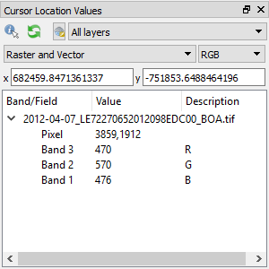

* Coordinates of the selected pixel are shown in the ``x`` and ``y`` fields. You may change the coordinate system of the
  displayed coordinates via the |crs| :superscript:`Select CRS` button.

.. |crs| image:: ../../eotimeseriesviewer/ui/icons/CRS.svg

|

Profile Visualization
^^^^^^^^^^^^^^^^^^^^^

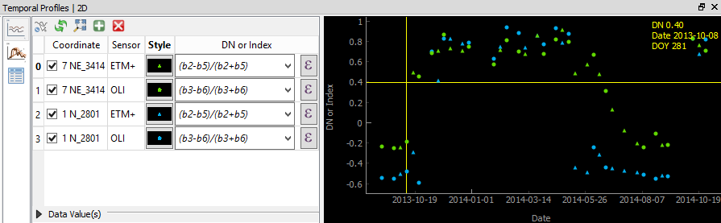

    Example: Temporal NDSI (Normalized Difference Snow Index) profile for 2 locations using Landsat 7 and 8 images.

Temporal Profiles
.................

The Temporal Profiles panel lets you visualize temporal profiles (2D) as well as temporal-spectral profiles (3D; experimental!).
On the left side you can switch between the different modes, i.e. |temporal2d| :superscript:`2D` and |temporal3d|
:superscript:`3D`. The coordinates |temporal_coords| page lists the coordinates of the temporal profiles.

**Adding and managing a temporal profile:**

* You can use the |icon_select_ts_profile| button to click on a location on the map an retrieve the temporal profile.
* Mind how the selected pixel now also appears on the coordinates |temporal_coords| page!
* If you select further pixels ( |icon_select_ts_profile| ), they will be listed in the coordinates page,
  but not automatically visualized in the plot.
* Use |add| to create an additional plot layer, and double click in the ``Coordinate`` field in order to select the
  desired location (so e.g. the newly chosen pixel) or just change the location in the current plot layer.
* Similarly, you can change the sensor to be visualized by double clicking inside the ``Sensor`` field and choosing from
  the dropdown.
* Click inside the ``Style`` field to change the visual representation of your time series in the plot.
* Remove a time series profile by selecting the desired row(s) and click |remove|.
* The ``DN or Index`` field depicts which values will be plotted.

    * Here you may select single bands (e.g. b1 for the first band)
    * or you can calculate indices on-the-fly: e.g. for the Landsat images in the example dataset the expression (b4-b3)/(b4+b3)
      would return the NDVI.

        .. figure:: img/example_temppindex.png

            Example of visualizing the NDVI for the same location for different sensors (example dataset).
* You can also move the map views to a desired date from the plot directly by :menuselection:`Right-click into plot --> Move maps to ...`

.. note:: The EO TSV won't extract and load all pixel values into memory by default in order to reduce processing time (only the ones required).
          You can manually load all the values by selecting the rows on the coordinates |temporal_coords| page :menuselection:`--> Right-click --> Load missing/reload`,
          or click the |loadmissingvalues| button.
          See information in the ``loaded`` and ``percent`` column.

Importing or exporting locations:
 * You can also import locations from a vector file instead of collecting them from the map: Go to the coordinates |temporal_coords| page
   and add locations via the |addvector| button. The naming of the locations will be based on respective fields in the vector dataset.
 * If you want to save your locations, e.g. as shapefile or CSV, click on |save|.

Visualizing the temporal profile locations as points in the Map View:
 * Under :ref:`Map Properties` --> Vector Rendering select *Temporal profile*
 * Furthermore, you can focus the Map View center on the profile location, by clicking the :guilabel:`Move to` button
   in the table on the coordinates |temporal_coords| page

**Spectral-temporal plots (3D):**

.. todo:: This feature is still experimental and under development. Documentation will follow!

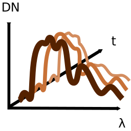

.. |remove| image:: ../../eotimeseriesviewer/ui/icons/mActionRemove.svg
    :width: 27px
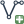
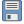

|

Spectral Library
................

The spectral library view allows you to visualize, label and export spectral profiles.

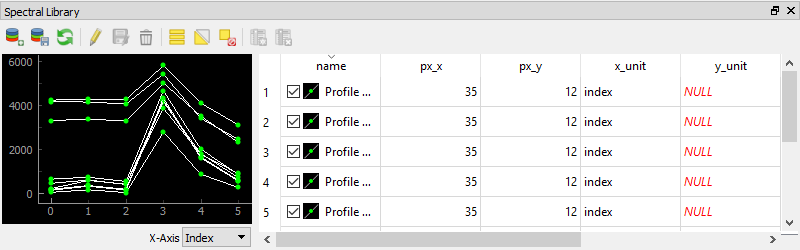

* Use the |spectral_profile| :superscript:`Select a spectrum from a map` button to extract and visualize a pixels profile
  (by clicking on a pixel on the map)
* You can add a selected spectrum to your spectral library by clicking on |addspectrum|.
* The gathered spectra are listed in the table on the right. For every spectrum additional metadata will be stored, e.g.
  the columns and rows (``px_x``, ``px_y``), the ``sensorname`` or the path of the respective file (``source``).
* When the |autoadd_profile| button is activated, the profile will be directly added to the library after clicking on a pixel.
* In the table, you can choose whether to display a spectral profile in the plot, by checking |cbc| or unchecking |cbu| it.
* Change the display style (color, shape, linetype) via :menuselection:`Right-click into respective row(s) --> Set Style`

.. note::
    The spectral library table behaves quite similar to the attribute table you know from QGIS:
        * You can edit the content by entering the editing mode (|startediting|)
        * You can add further information by adding fields via the |addattribute| button (e.g. different class labels).
          Remove them with |removeattribute|, accordingly.
        * Double click into a desired field to change its content
        * Remove spectra by selecting the desired row(s) in the table and click |deleteselected|

* Export or import a spectral library via the |importspeclib| |exportspeclib| buttons.

You can visualize the locations of your extracted spectra as points in the Map View:
 * Under :ref:`Map Properties` --> Vector Rendering select *Spectral Library*
 * Furthermore, you can focus the Map View center on a specific spectrum, by clicking the :guilabel:`Move to` button
   in the spectral library table

.. add further information on spectral library format or import/export. maybe link to enmap box documentation once its there

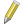
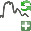
.. |deleteselected| image:: img/qgis_icons/mActionDeleteSelected.svg
    :width: 27px

|
|

