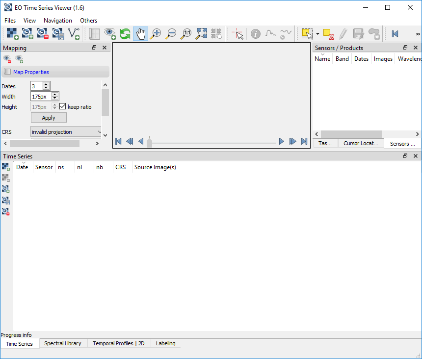

.. DEFINE ICONS AND IMAGE HERE

.. |cbc| image:: img/checkbox_checked.PNG
.. |cbu| image:: img/checkbox_unchecked.PNG
.. |ad_ra| image:: img/icons/mActionAddRasterLayer.svg
.. |re_ra| image:: img/icons/mActionRemoveTSD.svg
.. |timeseriesdock| image:: img/timeseriesdock.png

.. |icon_eotsv| image:: img/icons/icon.svg
    :width: 30px
.. |icon_zoom_in| image:: img/icons/mActionZoomIn.svg
    :width: 30px
.. |icon_zoom_out| image:: img/icons/mActionZoomOut.svg
    :width: 30px
.. |icon_zoom_pan| image:: img/icons/mActionPan.svg
    :width: 30px
.. |icon_zoom_full| image:: img/icons/mActionZoomFullExtent.svg
    :width: 30px
.. |icon_zoom_11| image:: img/icons/mActionZoomActual.svg
    :width: 30px
.. |icon_add_map_view| image:: img/icons/mActionAddMapView.svg
    :width: 30px
.. |icon_select_ts_profile| image:: img/icons/ActionIdentifyTimeSeries.svg
    :width: 30px

.. |icon_refresh| image:: img/icons/mActionRefresh.png
    :width: 30px

==========
User Guide
==========

Quick Start
-----------

1. Click |icon_eotsv| in the QGIS Tool Bar or via :menuselection:`Raster --> EO Time Series Viewer` to start the EO Time Series Viewer

2. Click :menuselection:`Files --> Add example` to load an examplary time series of Landsat and RapidEye observations.

3. Open the sensor panel :menuselection:`View --> Panels... --> Sensors / Products` and change the sensor names

    ============ =========
    Default      Changed
    ============ =========
    5bands@5.0m  RapidEye
    6bands@30.0m Landsat
    ============ =========

4. Use the scroll band and the map tools  |icon_zoom_in| |icon_zoom_out| |icon_zoom_pan| to change the temporal and spatial subset shown from the time series.

5. Open the Map View panel, change the map view name from `Map View 1` to `True Color` and set the multiband color render band selection to `RGB = 3-2-1` for both, Landsat and RapidEye images.

.. note:: Use |icon_refresh| to refresh or redraw related maps, spectral profile plots etc.

6. Now we like to Optimize the color stretch. Choose a none-clouded Landsat observation like 2104-06-24 and use the map context menu (right-mouse-click)
   to click on :menuselection:`Stretch to current extent ... --> Linear 5%`. Repeat with `Linear` and `Gaussian` stretch as well as for RapidEye images to
   see how this changes the band-specific min/max values in the Map View settings.

7. Click |icon_add_map_view| to create a second map view, respectively row of map images. Call it `Short-Wave IR` and the the multiband color render bands to
   ``Landsat RGB = 4-5-3`` and ``RapidEye RGB = 5-4-3``

8. Expand the `Map Properties` combobox (the first in the Map Views panel), increase the map size to 300x300 pixel and press `Apply`.

9. Bring the Temporal Profile panel :menuselection:`View --> Panels... --> Sensors / Products` and the `2D` page to the front.
   Click |icon_select_ts_profile| and select a map location to visualize the temporal profile for.
   Each selected map location will be listed in the panels' `Coordinate` page.

   Go back to the `2D` plot page and add a second profile with RapidEye data as Sensor source.
   Change the expression field to show the Normalized Difference Vegetation Index (NDVI) for both sensors:

   ======== ================
   Sensor   Expression NDVI
   ======== ================
   Landsat  (b4-b3)/(b4+b3)
   RapidEye (b5-b3)/(b5+b3)
   ======== ================

The Graphical User Interface
----------------------------

    This is what the EO Time Series Viewer's interface looks like when opening it.

.. note:: Just like in QGIS, many parts of the GUI are adjustable panels. You can arrange them as tabbed, stacked or separate windows.
          Activate/Deactivate panels under :menuselection:`View --> Panels`

Time Series
^^^^^^^^^^^

.. figure:: img/timeseriesdock.png

This window lists the individual input raster files of the time series.

* ``date`` corresponds to the image acquisition date as automatically derived by the TSV from the file name. Checking |cbc| or unchecking |cbu| the box in the date field will include or exclude the respective image from the display
* ``sensor`` shows the name of the sensor as defined in the :ref:`Sensors / Products` tab
* ``ns``: number of samples (pixels in x direction)
* ``nl``: number of lines (pixels in y direction)
* ``nb``: number of bands
* ``image``: path to the raster file

You can *add new rasters* to the time series by clicking |ad_ra| :superscript:`Add image to time series`.
Remove them by selecting the desired rows in the table (click on the row number) and pressing the |re_ra| :superscript:`Remove image from time series` button.

.. tip:: Click :menuselection:`Files --> Add example` to load a small example time series.

Sensors / Products
^^^^^^^^^^^^^^^^^^

.. figure:: img/sensordock.png

The EO Time Series Viewer automatically assesses different characteristics of the input images (number of bands, geometric resolution etc.)
and combines identical ones into sensor groups (or products). Those are listed as follows in the Sensor / Products window:

* ``name`` is automatically generated from the resolution and number of bands (e.g. *6bands@30.m*). This field is adjustable,
  i.e. you can change the name by double clicking into the field. The here defined name will be also displayed in the Map View and the Time Series table.
* ``nb``: number of bands
* ``n images``: number of images within the time series attributed to the according sensor
* ``wl``: comma separated string of the (center) wavelength of every band and [unit]
* ``id``: string identifying number of bands, geometric resolution and wavelengths (primary for internal use)

The Toolbar
^^^^^^^^^^^

+---------------------------------------------------+--------------------------------------------------+
| Button                                            |Function                                          |
+===================================================+==================================================+
| .. image:: img/icons/mActionAddRasterLayer.svg    |Add Raster Layer                                  |
+---------------------------------------------------+--------------------------------------------------+
| .. image:: img/icons/mActionAddTS.svg             |Add Time Series from CSV                          |
+---------------------------------------------------+--------------------------------------------------+
| .. image:: img/icons/mActionRemoveTS.svg          |Remove all images from Time Series                |
+---------------------------------------------------+--------------------------------------------------+
| .. image:: img/icons/mActionSaveTS.svg            |Save Time Series as CSV file                      |
+---------------------------------------------------+--------------------------------------------------+
| .. image:: img/icons/mActionAddMapView.svg        |Add maps that show a specified band selection     |
+---------------------------------------------------+--------------------------------------------------+
| .. image:: img/icons/mActionRefresh.png           |Refresh maps                                      |
+---------------------------------------------------+--------------------------------------------------+
| .. image:: img/icons/mActionZoomPoint.svg         |Select center coordinate                          |
+---------------------------------------------------+--------------------------------------------------+
| .. image:: img/icons/mActionZoomIn.svg            |Zoom into map                                     |
+---------------------------------------------------+--------------------------------------------------+
| .. image:: img/icons/mActionZoomOut.svg           |Zoom out                                          |
+---------------------------------------------------+--------------------------------------------------+
| .. image:: img/icons/mActionZoomFullExtent.svg    |Zoom to maximum extent of time series             |
+---------------------------------------------------+--------------------------------------------------+
| .. image:: img/icons/mActionZoomActual.svg        |Zoom to pixel scale                               |
+---------------------------------------------------+--------------------------------------------------+
| .. image:: img/icons/mActionPan.svg               |Pan map                                           |
|   :width: 25px                                    |                                                  |
|   :height: 25px                                   |                                                  |
+---------------------------------------------------+--------------------------------------------------+
| .. image:: img/icons/mActionIdentify.svg          |Identify map layers                               |
|   :width: 25px                                    |                                                  |
|   :height: 25px                                   |                                                  |
+---------------------------------------------------+--------------------------------------------------+
| .. image:: img/icons/ActionIdentifyTimeSeries.svg |Identify pixel time series for specific coordinate|
|   :width: 25px                                    |                                                  |
|   :height: 25px                                   |                                                  |
+---------------------------------------------------+--------------------------------------------------+
| .. image:: img/icons/pickrasterspectrum.svg       |Select pixel profiles from map                    |
|   :width: 25px                                    |                                                  |
|   :height: 25px                                   |                                                  |
+---------------------------------------------------+--------------------------------------------------+
| .. image:: img/icons/metadata.svg                 |About                                             |
|   :width: 25px                                    |                                                  |
|   :height: 25px                                   |                                                  |
+---------------------------------------------------+--------------------------------------------------+

Map Visualization
^^^^^^^^^^^^^^^^^

.. figure:: img/mapviewdock.png

Map Properties
..............

In the map properties box you can specify **Width** and **Height**, as well as background **Color** and the **CRS** of the single map canvases.

.. image:: img/maprendering.png

* :guilabel:`Set Center` center the QGIS Map View to the same coordinate as the TSV Map View
* :guilabel:`Get Center` center the TSV Map View to the same coordinate as the QGIS Map View
* :guilabel:`Set Extent` zoom the QGIS Map View to the same extent as the TSV Map View
* :guilabel:`Get Extent` zoom the TSV Map View to the same extent as the QGIS Map View
* ``Load center profile``, when checked |cbc|, the temporal profile of the center pixel will automatically be displayed and updated in the :ref:`Profile View` tab.

Map Views
.........

A map view is a row of map canvases that show the time series images of different sensors/product in the same band band combination, e.g. as "True Color bands".
The map view panel allows to add or remove map views and to specifiy how the images of each sensor are to be rendered.

* You can *add new Map Views* using the |addmapview| button. This will create a now row of map canvases. Remove a map view via |removemapview|.
* In case the Map View does not refresh correctly, you can 'force' the refresh using the |refresh| button (which will also apply all the render settings).
* Access the settings for individual Map Views via the dropdown menu |mapviewdropdown|
* You can use the |questionmark| button to *highlight the current Map View* selected in the dropdown menu (respective image chips will show red margin for a few seconds).

Now, for every Map View you can alter the following settings:

* *Hide/Unhide* the Map View via the |hidemapview| :superscript:`Toggle visibility of this map view` button.

* *Activate/Deactivate Crosshair* via the |crosshair| :superscript:`Show/hide a crosshair` button. Press the arrow button next to it to enter
  the *Crosshair specifications* |symbology| , where you can customize e.g. color, opacity, thickness, size and further options.

* You may rename the Map View by altering the text in the ``Name`` field.

* **Vector Rendering** allows you to visualize vector data (e.g. a shapefile). In order to do so, open the file in QGIS. Once loaded in the QGIS Layers Panel, it will become selectable
  in the dropdown menu. Vector styling will be same as in QGIS (i.e. if you want to adjust it, do it in QGIS). Check |cbc| or uncheck |cbu| in order to activate/deactivate Vector Rendering.

* Under **Raster Rendering** you can adjust the visualisation of the raster layers. Every sensor, as specified in the :ref:`Sensors / Products` tab, has its separate
  rendering option section (since band specifications differ among sensors). The handling is very similar to the QGIS style options.

        * Multiband (RGB) as well as singleband rendering is supported. Select the desired mode in the dropdown menu.

        * Select the desired band(s) for display using the slider. In the dropdown menu at the bottom you can specify the contrast enhancement to be used for the value stretch.
          In case TSV has sufficient wavelength information for the bands, you can choose several presets: *True* (True Color; red-green-blue),
          *CIR1* (colored infrared; swir-red-green) and *CIR2* (colored infrared; swIR-mwIR-red)

        * You can copy and paste styles using the |copy| :superscript:`Copy style to clipboard` and |paste| :superscript:`Paste style from clipboard` buttons (also between QGIS and TSV)

        * Once you specified your rendering settings, press |refresh| to apply them.

.. |addmapview| image:: img/icons/mActionAddMapView.svg
.. |removemapview| image:: img/icons/mActionRemoveMapView.svg
.. |refresh| image:: img/icons/mActionRefresh.png
.. |mapviewdropdown| image:: img/icons/mapviewdropdown.png
.. |questionmark| image:: img/icons/questionmark.png
.. |hidemapview| image:: img/icons/mapviewHidden.svg
    :height: 25px
    :width: 25px
.. |crosshair| image:: img/icons/crosshair.svg
    :height: 25px
    :width: 25px
.. |symbology| image:: img/icons/symbology.svg
    :height: 25px
    :width: 25px
.. |copy| image:: img/icons/mActionEditCopy.svg
.. |paste| image:: img/icons/mActionEditPaste.svg

Cursor Location Values
^^^^^^^^^^^^^^^^^^^^^^

Similar to the Identify tool in QGIS, you can retrieve the pixel information for the images in your time series. First click on the
|identify| :superscript:`Select cursor location` button and then on a desired pixel in the Map Views.
In case the Map View contains (additional) vector data, location information will also be retrieved for those features.

.. image:: img/cursorlocationvalues.png

* Coordinates of the selected pixel are shown in the ``x`` and ``y`` fields. You may change the coordinate system of the displayed coordinates via the |crs| :superscript:`Select CRS` button.

.. |identify| image:: img/icons/mActionIdentify.svg
    :width: 25px
    :height: 25px

.. |crs| image:: img/icons/CRS.svg

|
|

Profile Visualization
^^^^^^^^^^^^^^^^^^^^^
|
|

Temporal Profiles
.................

|
|

Spectral Library
................

|
|

