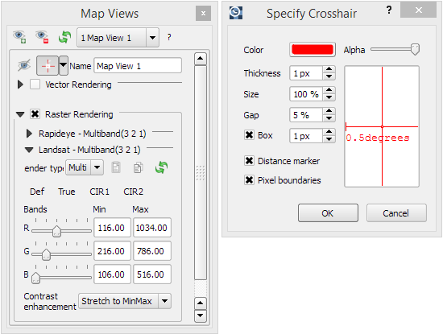

==========
User Guide
==========

The Interface
-------------

.. figure:: img/interface.png

    This is what the Time Series Viewer's interface looks like when opening it.

.. note:: Just like in QGIS, many parts of the GUI are adjustable panels. Therefore you can arrange them either tabbed or in separate windows. Activate/Deactivate panels under *View* >> *Panels*

The Toolbar
~~~~~~~~~~~

+---------------------------------------------------+--------------------------------------------------+
| Button                                            |Function                                          |
+===================================================+==================================================+
| .. image:: img/icons/mActionAddRasterLayer.svg    |Add Raster Layer                                  |
+---------------------------------------------------+--------------------------------------------------+
| .. image:: img/icons/mActionAddTS.svg             |Add Time Series from CSV                          |
+---------------------------------------------------+--------------------------------------------------+
| .. image:: img/icons/mActionRemoveTS.svg          |Remove all images from Time Series                |
+---------------------------------------------------+--------------------------------------------------+
| .. image:: img/icons/mActionSaveTS.svg            |Save Time Series as CSV file                      |
+---------------------------------------------------+--------------------------------------------------+
| .. image:: img/icons/mActionAddMapView.svg        |Add maps that show a specified band selection     |
+---------------------------------------------------+--------------------------------------------------+
| .. image:: img/icons/mActionRefresh.png           |Refresh maps                                      |
+---------------------------------------------------+--------------------------------------------------+
| .. image:: img/icons/mActionZoomPoint.svg         |Select center coordinate                          |
+---------------------------------------------------+--------------------------------------------------+
| .. image:: img/icons/mActionZoomIn.svg            |Zoom into map                                     |
+---------------------------------------------------+--------------------------------------------------+
| .. image:: img/icons/mActionZoomOut.svg           |Zoom out                                          |
+---------------------------------------------------+--------------------------------------------------+
| .. image:: img/icons/mActionZoomFullExtent.svg    |Zoom to maximum extent of time series             |
+---------------------------------------------------+--------------------------------------------------+
| .. image:: img/icons/mActionZoomActual.svg        |Zoom to pixel scale                               |
+---------------------------------------------------+--------------------------------------------------+
| .. image:: img/icons/mActionPan.svg               |Pan map                                           |
|   :width: 25px                                    |                                                  |
|   :height: 25px                                   |                                                  |
+---------------------------------------------------+--------------------------------------------------+
| .. image:: img/icons/mActionIdentify.svg          |Identify map layers                               |
|   :width: 25px                                    |                                                  |
|   :height: 25px                                   |                                                  |
+---------------------------------------------------+--------------------------------------------------+
| .. image:: img/icons/ActionIdentifyTimeSeries.svg |Identify pixel time series for specific coordinate|
|   :width: 25px                                    |                                                  |
|   :height: 25px                                   |                                                  |
+---------------------------------------------------+--------------------------------------------------+
| .. image:: img/icons/pickrasterspectrum.svg       |Select pixel profiles from map                    |
|   :width: 25px                                    |                                                  |
|   :height: 25px                                   |                                                  |
+---------------------------------------------------+--------------------------------------------------+
| .. image:: img/icons/metadata.svg                 |About                                             |
|   :width: 25px                                    |                                                  |
|   :height: 25px                                   |                                                  |
+---------------------------------------------------+--------------------------------------------------+

Map Views Main Window
~~~~~~~~~~~~~~~~~~~~~

|

Map Views
^^^^^^^^^

This panel mainly divides into two sections: The upper bar, where you can select/add/remove Map Views and the lower part,
where you can adjust settings (e.g. display style) for every Map View individually.

* You can *add new Map Views* using the |addmapview| button. Remove them via |removemapview|.
* In case the Map View does not refresh correctly, you can 'force' the refresh using the |refresh| button (which will also apply all the render settings).
* Access the settings for individual Map Views via the dropdown menu |mapviewdropdown|
* You can use the |questionmark| button to *highlight the current Map View* selected in the dropdown menu (respective image chips will show red margin for a few seconds).

Now, for every Map View you can alter the following settings:

* *Hide/Unhide* the Map View via the |hidemapview| :superscript:`Toggle visibility of this map view` button.
* *Activate/Deactivate Crosshair* via the |crosshair| :superscript:`Show/hide a crosshair` button. Press the arrow button next to it to enter the *Crosshair specifications* |symbology|, where you can
  customize e.g. color, opacity, thickness, size and further options.
* You may rename the Map View by altering the text in the ``Name`` field.
* **Vector Rendering** allows you to visualize vector data (e.g. a shapefile). In order to do so, open the file in QGIS. Once loaded in the QGIS Layers Panel, it will become selectable
  in the dropdown menu. Vector styling will be same as in QGIS (i.e. if you want to adjust it, do it in QGIS). Check |cbc| or uncheck |cbu| in order to activate/deactivate Vector Rendering.
* Under **Raster Rendering** you can adjust the visualisation of the raster layers. Every sensor, as specified in the :ref:`Sensors / Products` tab, has its separate
  rendering option section (since band specifications differ among sensors). The handling is very similar to the QGIS style options.
        * Multiband (RGB) as well as singleband rendering is supported. Select the desired mode in the dropdown menu.
        * Select the desired band(s) for display using the slider. In the dropdown menu at the bottom you can specify the contrast enhancement to be used for the value stretch.
        * You can copy and paste styles using the |copy| :superscript:`Copy style to clipboard` and |paste| :superscript:`Paste style from clipboard` buttons (also between QGIS and TSV)
        * Once you specified your rendering settings, press |refresh| to apply them.

.. |addmapview| image:: img/icons/mActionAddMapView.svg
.. |removemapview| image:: img/icons/mActionRemoveMapView.svg
.. |refresh| image:: img/icons/mActionRefresh.png
.. |mapviewdropdown| image:: img/icons/mapviewdropdown.png
.. |questionmark| image:: img/icons/questionmark.png
.. |hidemapview| image:: img/icons/mapviewHidden.svg
    :height: 25px
    :width: 25px
.. |crosshair| image:: img/icons/crosshair.svg
    :height: 25px
    :width: 25px
.. |symbology| image:: img/icons/symbology.svg
    :height: 25px
    :width: 25px
.. |copy| image:: img/icons/mActionEditCopy.svg
.. |paste| image:: img/icons/mActionEditPaste.svg

|

Sensors / Products
^^^^^^^^^^^^^^^^^^

The TSV automatically assesses different characteristics of the input images (number of bands, geometric resolution etc.)
and combines identical ones into sensor groups (or products). Those are listed as follows in the Sensor / Products window:

==== == ======== == ==
name nb n images wl id
==== == ======== == ==
==== == ======== == ==

* ``name`` is automatically generated from the resolution and number of bands (e.g. *6bands@30.m*). This field is adjustable,
  i.e. you can change the name by double clicking into the field. The here defined name will be also displayed in the Map View and the Time Series table.
* ``nb``: number of bands
* ``n images``: number of images within the time series attributed to the according sensor
* ``wl``:
* ``id``:

|

Cursor Location Values
^^^^^^^^^^^^^^^^^^^^^^

Similar to the Identify tool in QGIS, you can retrieve the pixel information for the images in your time series. First click on the |identify| button and then on a desired pixel in the Map Views.
In case the Map View contains (additional) vector data, location information will also be retrieved for those features.

* Coordinates of the selected pixel are shown in the **x** and **y** fields. You may change the coordinate system of the displayed coordinates via the |crs| button.

.. |identify| image:: img/icons/mActionIdentify.svg
    :width: 25px
    :height: 25px

.. |crs| image:: img/icons/CRS.svg

|

Map Rendering
^^^^^^^^^^^^^

In the Map Rendering options you can specify **Width** and **Height**, as well as background **Color** and the **CRS** of the image chips in the Main Map View.

* ``Set Center`` center the QGIS Map View to the same coordinate as the TSV Map View
* ``Get Center`` center the TSV Map View to the same coordinate as the QGIS Map View
* ``Set Extent`` zoom the QGIS Map View to the same extent as the TSV Map View
* ``Get Extent`` zoom the TSV Map View to the same extent as the QGIS Map View
* ``Load center profile`` when checked |cbc|, the temporal profile of the center pixel will automatically be displayed and updated in the :ref:`Profile View` tab.

|

Profile View
~~~~~~~~~~~~

Spectral Library
~~~~~~~~~~~~~~~~

|

Time Series Tab
~~~~~~~~~~~~~~~

In this window the individual components (input rasters) of the time series are listed as follows:

===== ====== == == == =====
date  sensor ns nl nb image
===== ====== == == == =====
|cbc|
===== ====== == == == =====

where

* ``date`` corresponds to the image acquisition date as automatically derived by the TSV from the file name. Checking |cbc| or unchecking |cbu| the box in the date field will include or exclude the respective image from the display
* ``sensor`` shows the name of the sensor as defined in the :ref:`Sensors / Products` tab
* ``ns``: number of samples (pixels in x direction)
* ``nl``: number of lines (pixels in y direction)
* ``nb``: number of bands
* ``image``: path to the raster file

You can *add new rasters* to the time series by clicking |ad_ra| . Remove them by selecting the desired rows in the table (click on the row number) and pressing the |re_ra| button.

.. |cbc| image:: img/checkbox_checked.PNG
.. |cbu| image:: img/checkbox_unchecked.PNG
.. |ad_ra| image:: img/icons/mActionAddRasterLayer.svg
.. |re_ra| image:: img/icons/mActionRemoveTSD.svg

Getting Started
---------------
This section will demonstrate the process of setting up your own time series as a step-by-step guide.

Import Data
~~~~~~~~~~~
