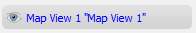
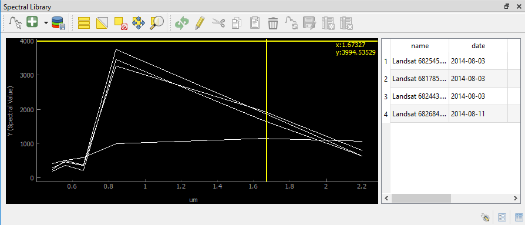
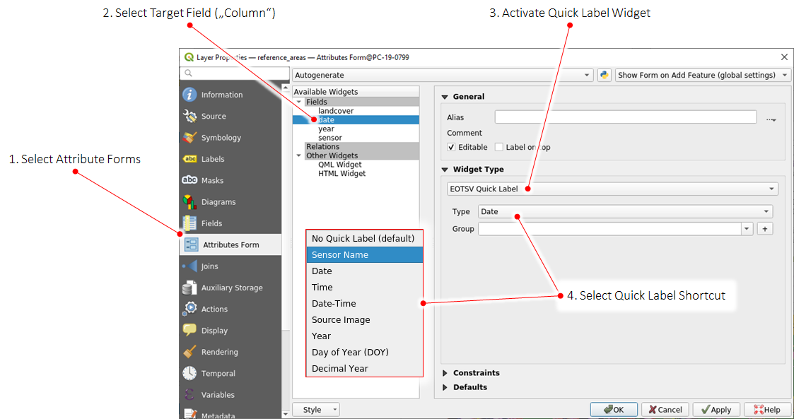

.. DEFINE ICONS AND IMAGE HERE

.. include:: /icon_links.rst

.. |cbc| image:: img/checkbox_checked.png
.. |cbu| image:: img/checkbox_unchecked.png

.. |timeseriesdock| image:: img/timeseriesdock.png

.. |questionmark| image:: img/questionmark.png

==========
User Guide
==========

Quick Start
-----------

1. Click |icon| in the QGIS Tool Bar or via :menuselection:`Raster --> EO Time Series Viewer` to start the EO Time Series Viewer

2. Click :menuselection:`Files --> Add example` to load an exemplary time series of Landsat and RapidEye observations.

   Open the sensor panel :menuselection:`View --> Panels... --> Sensors / Products` and change the sensor names

   ============ =========
   Default      Changed
   ============ =========
   6bands@30.0m Landsat
   5bands@5.0m  RapidEye3
   ============ =========

   The change of sensor names becomes visible in other other parts of the GUI as well, e.g. the
   list of time series source images.

4. Use the scroll band and the map tools  |mActionZoomIn| |mActionZoomOut| |mActionPan| to change the temporal and spatial subset shown from the time series.

5. Open the Mapping panel, change the map view name from `Map View 1` to `True Color` and set the multiband color render
   band selection to `RGB = 3-2-1` for both, Landsat and RapidEye images (right-click on layer, :menuselection:`Set Properties --> Style`).

.. note:: Use |mActionRefresh| to refresh or redraw related maps, spectral profile plots etc.

6. Now we like to optimize the color stretch. Choose a -clouded Landsat observation like 2014-06-24 and use the map context menu (right-mouse-click)
   to click on :menuselection:`Stretch to current extent ... --> Linear 5%`. Repeat with `Linear` and `Gaussian` stretch as well as for RapidEye images to
   see how this changes the band-specific min/max values in the Map View settings.

7. Click |mActionAddMapView| to create a second map view, respectively row of map images. Call it ``Short-Wave IR`` and the the multiband color render bands to
   *Landsat RGB = 4-5-3* and *RapidEye RGB = 5-4-3*

8. Expand the :guilabel:`Map Properties` combobox (in the Mapping panel), increase the map size to 300x300 pixel and press :guilabel:`Apply`.

9. Bring the Temporal Profile panel :menuselection:`View --> Panels... --> Sensors / Products` and the `2D` page to the front.
   Click |mIconTemporalProfile| and select a map location to visualize the temporal profile for.
   Each selected map location will be listed in the panels |mActionOpenTable| :guilabel:`Coordinate` page.

   Go back to the `2D` plot page and add a second profile with RapidEye data as Sensor source.
   Change the expression field to show the Normalized Difference Vegetation Index (NDVI) for both sensors:

   ======== ================
   Sensor   Expression NDVI
   ======== ================
   Landsat  (b4-b3)/(b4+b3)
   RapidEye (b5-b3)/(b5+b3)
   ======== ================

|

....

|

The Graphical User Interface
----------------------------

.. figure:: img/interface.png
   :width: 100%

   This is what the EO Time Series Viewer's interface looks like when opening it.

.. note:: Just like in QGIS, many parts of the GUI are adjustable panels. You can arrange them as tabbed, stacked or separate windows.
          Activate/Deactivate panels under :menuselection:`View --> Panels`

|

Time Series
^^^^^^^^^^^

This window lists the individual input raster files of the time series.

.. figure:: img/timeseriespanel.png

* **Date** corresponds to the image acquisition date as automatically derived by the EO TSV from the file name. Checking |cbc| or unchecking |cbu| the box in the date field will include or exclude the respective image from the display
* **Sensor** shows the name of the sensor as defined in the :ref:`Sensors / Products` tab
* **ns**: number of samples (pixels in x direction)
* **nl**: number of lines (pixels in y direction)
* **nb**: number of bands
* **image**: path to the raster file

You can add new rasters to the time series by clicking |mActionAddRasterLayer| :superscript:`Add image to time series`.
Remove them by selecting the desired rows in the table (click on the row number) and pressing the |mActionRemoveTSD| :superscript:`Remove image from time series` button.

.. tip::

   If you have your time series available as one large raster stack, you can import this file via :menuselection:`Files --> Add images from time stack`

.. tip:: Click :menuselection:`Files --> Add example` to load a small example time series.

|

Sensors / Products
^^^^^^^^^^^^^^^^^^

.. figure:: img/sensordock.png

The EO Time Series Viewer automatically assesses different characteristics of the input images (number of bands, geometric resolution etc.)
and combines identical ones into sensor groups (or products). Those are listed as follows in the Sensor / Products window:

* ``name`` is automatically generated from the resolution and number of bands (e.g. *6bands@30.m*). This field is adjustable,
  i.e. you can change the name by double-clicking into the field. The here defined name will be also displayed in the Map View and the Time Series table.
* ``nb``: number of bands
* ``n images``: number of images within the time series attributed to the according sensor
* ``wl``: comma separated string of the (center) wavelength of every band and [unit]
* ``id``: string identifying number of bands, geometric resolution and wavelengths (primary for internal use)

|

The Toolbar
^^^^^^^^^^^

.. csv-table::
   :header: "Button", "Function"

   |mActionAddRasterLayer|, Add images to the time series
   |mActionAddTS|, Add Time Series from CSV
   |mActionRemoveTS|, Remove all images from Time Series
   |mActionSaveTS|, Save Time Series as CSV file
   |mActionAddOgrLayer|, Add vector data file
   |qgsMapCenter|, Synchronize with QGIS map canvas
   |mActionAddMapView|, Add maps that show a specified band selection
   |mActionRefresh|, Refresh maps
   |mActionPan|, Pan map
   |mActionZoomIn|, Zoom into map
   |mActionZoomOut|, Zoom out
   |mActionZoomActual|, Zoom to pixel scale
   |mActionZoomFullExtent|, Zoom to maximum extent of time series
   |pan_center|, Center map on clicked locations
   |select_location|, Identify Pixels and Features
   |mActionPropertiesWidget|, Identify cursor location values
   |profile|, Identify raster profiles to be shown in a Spectral Library
   |mIconTemporalProfile|, Identify pixel time series for specific coordinate
   |mActionSelectRectangle|, Select Features
   |mActionToggleEditing|, Start Editing Mode
   |mActionSaveEdits|, Save Edits
   |mActionCapturePolygon|, Draw a new Feature

.. note::

   Only after |select_location| :sup:`Identify Pixels and Features` is activated you can select the other identify tools
   (|mActionPropertiesWidget|, |profile|, |mIconTemporalProfile|). You can activate them all at once as well as  of them,
   in case of the latter variant clicking in the map has no direct effect (other than moving the crosshair, when activated)

|

Map Visualization
^^^^^^^^^^^^^^^^^

Map Properties
..............

In the map properties box you can specify :guilabel:`Width` and :guilabel:`Height`, as well as background :guilabel:`Color` and the :guilabel:`CRS` of the single map canvases.
Click :guilabel:`Apply` to apply changes. By default the :guilabel:`keep ratio` option is |cbc| checked, i.e. height will be the same as width. In case
you want to have unequally sized views, deactivate this option.

.. image:: img/mapproperties.png

.. * :guilabel:`Set Center` center the QGIS Map View to the same coordinate as the EO TSV Map View
.. * :guilabel:`Get Center` center the EO TSV Map View to the same coordinate as the QGIS Map View
.. * :guilabel:`Set Extent` zoom the QGIS Map View to the same extent as the EO TSV Map View
.. * :guilabel:`Get Extent` zoom the EO TSV Map View to the same extent as the QGIS Map View
.. * ``Load center profile``, when checked |cbc|, the temporal profile of the center pixel will automatically be displayed and updated in the :ref:`Profile View` tab.

Map Views
.........

A map view is a row of map canvases that show the time series images of different sensors/product in the same band combination, e.g. as "True Color bands".
The map view panel allows to add or remove map views and to specifiy how the images of each sensor are to be rendered.

* You can *add new Map Views* using the |mActionAddMapView| button. This will create a new row of map canvases. Remove a map view with the |mActionRemoveMapView| button.
* In case the Map View does not refresh correctly, you can 'force' the refresh using the |mActionRefresh| button (which will also apply all the render settings).
* Access the settings for individual Map Views by clicking in the mapview |mapviewbutton|
* You can use the |questionmark| button to highlight the current Map View selected in the dropdown menu (respective image chips will show red margin for a few seconds).

For every Map View you can alter the following settings:

* *Hide/Unhide* the Map View via the |mapviewHidden| :superscript:`Toggle visibility of this map view` button.

* *Activate/Deactivate Crosshair* via the |crosshair| :superscript:`Show/hide a crosshair` button. Press the arrow button next to it to enter
  the *Crosshair specifications* |symbology| , where you can customize e.g. color, opacity, thickness, size and further options.

* You may rename the Map View by altering the text in the :guilabel:`Name` field.

.. * **Vector Rendering** allows you to visualize vector data (e.g. a shapefile). In order to do so, open the file in QGIS. Once loaded in the QGIS Layers Panel, it will become selectable
..  in the dropdown menu. Vector styling will be same as in QGIS (i.e. if you want to adjust it, do it in QGIS). Check |cbc| or uncheck |cbu| in order to activate/deactivate Vector Rendering.
  Furthermore, you can visualize the locations of :ref:`Temporal Profiles` or :ref:`Spectral Profiles <Spectral Library>` as points. Select the desired option
  from the dropdown list.

**Layer representation:**

* Similar to QGIS you can change the visual representation of raster or vector layers in the layer properties. To open them,
  right-click on the layer you want to alter and select :menuselection:`Set Properties --> Style`

  .. image:: img/layerproperties.png

|

Cursor Location Values
^^^^^^^^^^^^^^^^^^^^^^

This tools lets you inspect the values of a layer or multiple layers at the location where you click in the map view. To select a location (e.g. pixel or feature)
use the |select_location| :superscript:`Select Cursor Location` button and click somewhere in the map view.

* The Cursor Location Value panel should open automatically and list the information for a selected location. The layers will be listed in the order they appear in the Map View.
  In case you do not see the panel, you can open it via :menuselection:`View --> Panels --> Cursor Location Values`.

  .. figure:: img/cursorlocationvalues.png

* By default, raster layer information will only be shown for the bands which are mapped to RGB. If you want to view all bands, change the :guilabel:`Visible` setting
  to :guilabel:`All` (right dropdown menu). Also, the first information is always the pixel coordinate (column, row).
* You can select whether location information should be gathered for :guilabel:`All layers` or only the :guilabel:`Top layer`. You can further
  define whether you want to consider :guilabel:`Raster and Vector` layers, or :guilabel:`Vector only` and :guilabel:`Raster only`, respectively.
* Coordinates of the selected location are shown in the :guilabel:`x` and :guilabel:`y` fields. You may change the coordinate system of the displayed
  coordinates via the |mActionSetProjection| :superscript:`Select CRS` button (e.g. for switching to lat/long coordinates).

|

Profile Visualization
^^^^^^^^^^^^^^^^^^^^^

.. figure:: img/example_2dprofile.png

    Example: Temporal NDSI (Normalized Difference Snow Index) profile for 2 locations using Landsat 7 and 8 images.

Temporal Profiles
.................

The Temporal Profiles panel lets you visualize temporal profiles.
On the left side you can switch between the |mIconTemporalProfile2D| profile and the coordinates |mActionOpenTable| page. The latter
lists all coordinates of selected or imported profile locations.

Adding and managing a temporal profile:
 * You can use the |mIconTemporalProfile| button to click on a location on the map an retrieve the temporal profile, or
   in the toolbar select |select_location| + |mIconTemporalProfile|.
 * Mind how the selected pixel now also appears on the coordinates |mActionOpenTable| page!
 * If you select further pixels ( |mIconTemporalProfile| ), they will be listed in the coordinates page,
   but not automatically visualized in the plot.
 * Use |mActionAdd| to create an additional plot layer, and double-click in the :guilabel:`Coordinate` field in order to select the
   desired location (so e.g. the newly chosen pixel) or just change the location in the current plot layer.
 * Similarly, you can change the sensor to be visualized by double-clicking inside the :guilabel:`Sensor` field and choosing from
   the dropdown.
 * Click inside the :guilabel:`Style` field to change the visual representation of your time series in the plot.
 * Remove a time series profile by selecting the desired row(s) and click |mActionRemove|.
 * The :guilabel:`DN or Index` field depicts which values will be plotted.

     * Here you may select single bands (e.g. ``b1`` for the first band)
     * or you can calculate indices on-the-fly: e.g. for the Landsat images in the example dataset the expression ``(b4-b3)/(b4+b3)``
       would return the NDVI.

         .. figure:: img/example_temppindex.png

             Example of visualizing the NDVI for the same location for different sensors (example dataset).

 * You can also move the map views to a desired date from the plot directly by right-click into plot :menuselection:`--> Move maps to ...`

 .. note:: The EO TSV won't extract and load all pixel values into memory by default in order to reduce processing time (only the ones required).
           You can manually load all the values by clicking the |mIconTemporalProfileRefresh| :sup:`Load missing band values` button
           on the coordinates |mActionOpenTable| page.

Importing or exporting locations:
 * You can also import locations from a vector file instead of collecting them from the map: Go to the coordinates |mActionOpenTable| page
   and add locations via the |mActionAddOgrLayer| button.
 * If you want to save your locations, e.g. as shapefile or CSV, click on |mActionFileSave|.

|

Spectral Library
................

The spectral library view allows you to visualize, label and export spectral profiles.

* Use the |pickrasterspectrum| :superscript:`Select a spectrum from a map` button to extract and visualize a pixels profile
  (by clicking on a pixel on the map).
* You can add a selected spectrum to your spectral library by clicking on |profile2speclib|.
* The gathered spectra are listed in the table on the right. For every spectrum additional metadata will be stored, e.g.
  the date, day of year and sensor.
* When the |profile2speclib_auto| button is activated, the profile will be directly added to the library after clicking on a pixel.
* Change the display style (color, shape, linetype) in the Spectral Library Properties, which can be accessed via the |action| button in the lower right.

.. note::
    The spectral library table behaves quite similar to the attribute table you know from QGIS:
        * You can edit the content by entering the editing mode |mActionToggleEditing|
        * You can add further information by adding fields via the |mActionNewAttribute| button (e.g. different class labels).
          Remove them with |mActionDeleteAttribute|, accordingly.
        * Double-click into a desired field to change its content
        * Remove spectra by selecting the desired row(s) in the table and click |mActionDeleteSelected|

Quick Labeling
--------------

The EO Time Series Viewer assists you in describing, i.e. *label*, reference data, e.g. to describe at the occurence of
land cover types and events. Whether your
locations (point, lines or polygons) of interest already exist, or are being digitized in the visualized maps first,
in both cases you want to describe them in the attribute table of the vector layer.

The EO Time Series Viewer supports this with "Quick Label" short-cuts from the map context menu. If triggered, they send
temporal or categorical information direct to the attribute cells of selected geometries, e.g a polygon that has been
selected in a map.

.. image:: img/quicklabel_workflow.png

Let's assume we have a map related to a Landsat (LND) observation taken at 2019-02-05T11:23:42.00.
The following table shows how this is translated into linked vector fields:

.. table:: Mapping of Quick Labels information into vector layer attributes

  +-------------------+---------------------+------+----------+---------------------+------------+----------+------+------+
  |                   |                 Type of linked vector layer field                                                 |
  +-------------------+---------------------+------+----------+---------------------+------------+----------+------+------+
  | LabelType         | varchar             | int  | double   | datetime            | date       | time     | bool | blob |
  +===================+=====================+======+==========+=====================+============+==========+======+======+
  | Date              | 2019-02-05          |      |          | 2019-02-05T00:00:00 | 2019-02-05 |          |      |      |
  +-------------------+---------------------+------+----------+---------------------+------------+----------+------+------+
  | Date-Time         | 2019-02-05T11:23:42 |      |          | 2019-02-05T11:23:42 | 2019-02-05 |          |      |      |
  +-------------------+---------------------+------+----------+---------------------+------------+----------+------+------+
  | Time              | 11:23:42            |      |          | 2019-02-05T11:23:42 |            | 11:23:42 |      |      |
  +-------------------+---------------------+------+----------+---------------------+------------+----------+------+------+
  | Day of Year (DOY) | 36                  | 36   | 36       |                     |            |          |      |      |
  +-------------------+---------------------+------+----------+---------------------+------------+----------+------+------+
  | Year              | 2019                | 2019 |          | 2019-02-05T11:23:42 | 2019-02-05 | 11:23:42 |      |      |
  +-------------------+---------------------+------+----------+---------------------+------------+----------+------+------+
  | Decimal Year      | 2019.0980926430518  | 2019 | 2019.098 |                     |            |          |      |      |
  +-------------------+---------------------+------+----------+---------------------+------------+----------+------+------+
  | Sensor Name       | LND                 |      |          |                     |            |          |      |      |
  +-------------------+---------------------+------+----------+---------------------+------------+----------+------+------+
  | Source Image      | /path/to/image      |      |          |                     |            |          |      |      |
  +-------------------+---------------------+------+----------+---------------------+------------+----------+------+------+

To use Quick Labels, open the vector layer properties and activate them in the Attribute Form widget:

