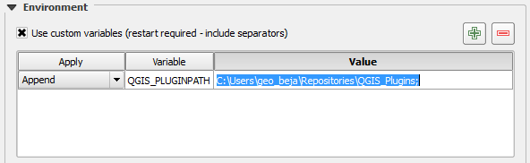
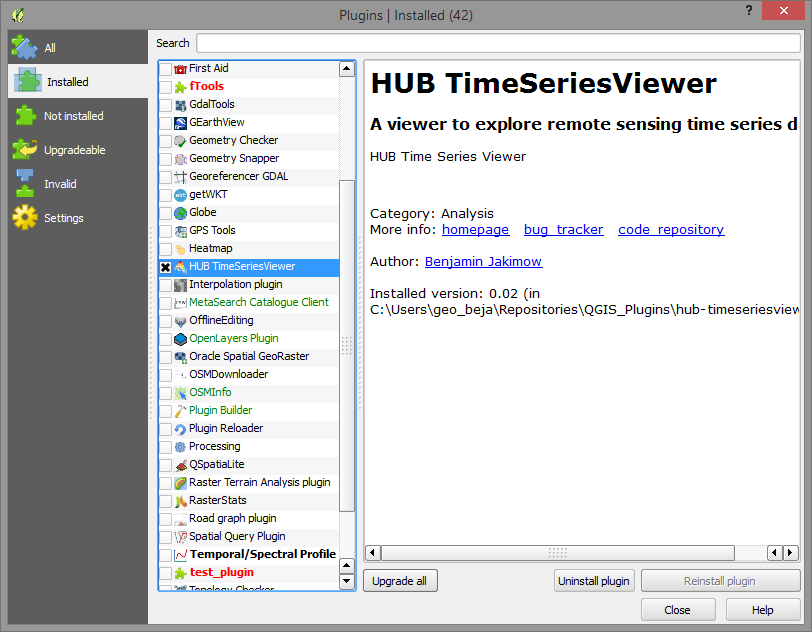

# Notes for test users of HUB TimeSeriesViewer (TSV)

1. Ensure that git is installed on your system.

    C:\Windows\system32>git

should produce a meaningful output.

If not existing, download git from:

    [git download](https://git-scm.com/download)

2. Create your personal "QGIS_Plugin" folder.

3. Clone the repository into the QGIS_Plugin folder and checkout the qgis_api branch by:

        git clone https://bitbucket.org/jakimowb/hub-timeseriesviewer.git
        cd hub-timeseriesviewer
        git fetch && git checkout qgis_api

   The source code of the qgis_api branch should now appear in QGIS_Plugin/hub-timeseriesviewer.

4. Tell QGIS where to find this folder by adding QGIS_Plugin to the QGIS_PLUGINPATH variable.
Create it variable in case it does not exist.

Settings > Options ... > System >

5. Re-start QGIS. Activate the Plugin to add the TSV start button
to the QGIS toolbar.

6. Get updates: go into the QGIS_Pluigin/hub-timeseriesviewer folder and call

        git pull

to get updates from the remote branch. Then restart QGIS.

